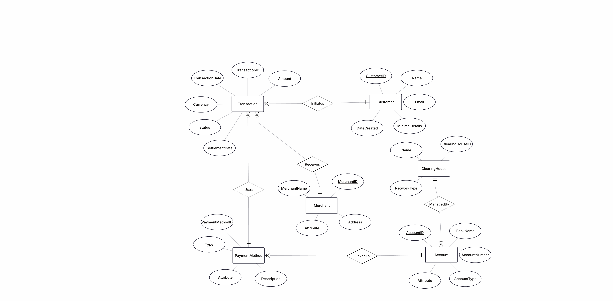
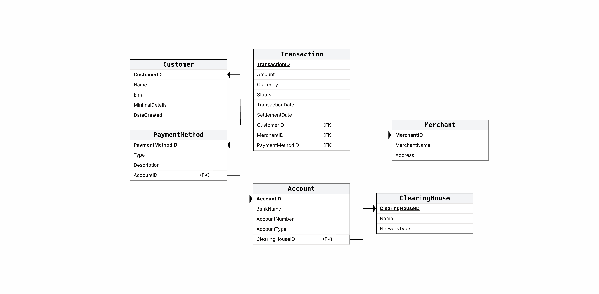

# Payment Clearing System Database - Stage 1

**Student IDs:** 215863135, 216252031

---

## 📊 Stage 1 - Database Design and Population

### Project Overview

This project implements a comprehensive **Payment Clearing System** database designed to handle the complete lifecycle of financial transactions from initiation to settlement. The system supports multiple payment methods, clearing houses, and provides full transaction tracking capabilities.

### Why This Domain?

Payment clearing systems are critical infrastructure in modern finance, handling billions of transactions daily. Our design addresses real-world challenges:
- **Multi-network support** - Different payment types require different clearing mechanisms
- **Regulatory compliance** - Full audit trail and settlement tracking
- **Scalability** - Must handle high transaction volumes efficiently
- **International operations** - Multi-currency and cross-border capabilities

---

## 🏗️ Database Design

### Entity-Relationship Model

Our system consists of **6 core entities** designed with proper normalization (3NF):

#### 1. **Customer** - Transaction Initiators
```
CustomerID (PK, INT) - Unique identifier
Name (VARCHAR) - Full customer name
Email (VARCHAR) - Contact information
MinimalDetails (VARCHAR) - Additional customer info
DateCreated (DATE) - Account creation timestamp
```
**Purpose:** Represents individuals or businesses initiating payments. The DateCreated field enables customer lifecycle analysis and fraud detection patterns.

#### 2. **Transaction** - Core Business Process
```
TransactionID (PK, INT) - Unique transaction identifier
Amount (INT) - Transaction value in cents
Currency (VARCHAR) - ISO currency code (USD, EUR, etc.)
Status (VARCHAR) - Processing status
TransactionDate (DATE) - When transaction was initiated
SettlementDate (DATE) - When funds were cleared
CustomerID (FK) - Links to customer
MerchantID (FK) - Links to merchant
PaymentMethodID (FK) - Links to payment method
```
**Purpose:** Central entity tracking every payment. Dual date fields (TransactionDate/SettlementDate) are crucial for settlement timing analysis and regulatory reporting.

#### 3. **Merchant** - Transaction Recipients
```
MerchantID (PK, INT) - Unique merchant identifier
MerchantName (VARCHAR) - Business name
Address (VARCHAR) - Business location
```
**Purpose:** Businesses receiving payments. Address information supports geographic analysis and risk assessment.

#### 4. **PaymentMethod** - Payment Instruments
```
PaymentMethodID (PK, INT) - Unique method identifier
Type (VARCHAR) - Payment type (Credit Card, ACH, Wire, etc.)
Description (VARCHAR) - Detailed method description
AccountID (FK) - Links to underlying account
```
**Purpose:** Abstracts different payment mechanisms. Links to accounts enable routing through appropriate clearing networks.

#### 5. **Account** - Financial Accounts
```
AccountID (PK, INT) - Unique account identifier
BankName (VARCHAR) - Financial institution name
AccountNumber (VARCHAR) - Account identifier
AccountType (VARCHAR) - Account classification
ClearingHouseID (FK) - Links to clearing network
```
**Purpose:** Represents bank accounts and financial instruments. Connection to clearing houses enables proper transaction routing.

#### 6. **ClearingHouse** - Payment Networks
```
ClearingHouseID (PK, INT) - Unique network identifier
Name (VARCHAR) - Network name (ACH, SWIFT, etc.)
NetworkType (VARCHAR) - Network classification
```
**Purpose:** Payment processing networks. Different transaction types require different clearing mechanisms (ACH for domestic, SWIFT for international, etc.).

---

### Visual Schema Representation

ER Diagram:



The ERD shows the logical relationships between entities:
- **One-to-Many**: Customer → Transactions (customers can have multiple transactions)
- **One-to-Many**: Merchant → Transactions (merchants receive multiple payments)
- **One-to-Many**: PaymentMethod → Transactions (payment methods used in multiple transactions)
- **Many-to-One**: PaymentMethod → Account (multiple payment methods can link to one account)
- **One-to-Many**: ClearingHouse → Account (clearing houses manage multiple accounts)

DS Diagram:



The DSD translates logical design into physical implementation with:
- Specific data types and constraints
- Primary and foreign key relationships
- Index optimization points

---

## 📈 Data Generation Strategy

### Why Realistic Data Matters
A payment system requires realistic transaction patterns to:
- Test performance under real-world loads
- Validate business logic with edge cases
- Enable meaningful analytics and reporting
- Support compliance and audit requirements

### Implementation Approach

We used **Python scripting** for data generation to ensure:
- **Realistic relationships** - Settlement dates after transaction dates
- **Business logic** - Appropriate transaction amounts and frequencies
- **Data consistency** - Valid foreign key relationships
- **Scalability** - Ability to generate large datasets efficiently

#### Data Generation Script
```python
# Key features of our DataGenerator.py:
- Seed-based randomization for reproducible results
- Realistic business names and addresses
- Transaction amounts following real-world distribution
- Proper date sequencing (settlement after transaction)
- Currency and status distributions matching industry patterns
```

### Generated Dataset Statistics

| Entity | Records | Purpose |
|--------|---------|---------|
| **ClearingHouse** | 7 | Major payment networks (ACH, SWIFT, Visa, etc.) |
| **Account** | 2,000 | Bank accounts across major institutions |
| **PaymentMethod** | 1,000 | Various payment instruments |
| **Customer** | 60,000 | Individual and business customers |
| **Merchant** | 15,000 | Businesses receiving payments |
| **Transaction** | **200,000** | **Main business process** |
| **TOTAL** | **278,007** | Complete dataset |

#### Transaction Distribution Analysis
- **60%** Small transactions ($1-$100) - Daily consumer purchases
- **25%** Medium transactions ($100-$1,000) - Business payments
- **15%** Large transactions ($1,000-$50,000) - Corporate transfers

#### Status Distribution
- **60%** Settled - Successfully processed
- **25%** Cleared - In clearing process  
- **10%** Pending/Failed/Cancelled - Various processing states

---

## 🔧 Database Implementation

### SQL Schema Creation
```sql
-- Example table creation with proper constraints
CREATE TABLE Transaction
(
  TransactionID INT NOT NULL,
  Amount INT NOT NULL,
  Currency VARCHAR(10) NOT NULL,
  Status VARCHAR(50) NOT NULL,
  TransactionDate DATE NOT NULL,
  SettlementDate DATE NOT NULL,
  CustomerID INT NOT NULL,
  MerchantID INT NOT NULL,
  PaymentMethodID INT NOT NULL,
  PRIMARY KEY (TransactionID),
  FOREIGN KEY (CustomerID) REFERENCES Customer(CustomerID),
  FOREIGN KEY (MerchantID) REFERENCES Merchant(MerchantID),
  FOREIGN KEY (PaymentMethodID) REFERENCES PaymentMethod(PaymentMethodID)
);
```

### Data Population Process

#### Step 1: Generate CSV Files
```bash
python3 DataGenerator.py
```
**Output:**
```
=== PAYMENT CLEARING DATA GENERATOR ===
Creating 200,000+ transaction records...

✓ Created 7 ClearingHouse records
✓ Created 2,000 Account records  
✓ Created 1,000 PaymentMethod records
✓ Created 60,000 Customer records
✓ Created 15,000 Merchant records
✓ Created 200,000 Transaction records

TOTAL: 278,007 records
```

#### Step 2: Database Import
```sql
-- Import generated data
COPY Customer FROM 'customer.csv' DELIMITER ',' CSV HEADER;
COPY Merchant FROM 'merchant.csv' DELIMITER ',' CSV HEADER;
COPY ClearingHouse FROM 'clearinghouse.csv' DELIMITER ',' CSV HEADER;
COPY Account FROM 'account.csv' DELIMITER ',' CSV HEADER;
COPY PaymentMethod FROM 'paymentmethod.csv' DELIMITER ',' CSV HEADER;
COPY Transaction FROM 'transaction.csv' DELIMITER ',' CSV HEADER;
```

---

## 💾 Database Backup and Recovery

### Database Dump Command
```bash
pg_dump -h localhost -U username -d payment_clearing_db > payment_clearing_backup.sql
```

### Dump Output Example
```
-- PostgreSQL database dump
-- Database: payment_clearing_db
-- Dumped by pg_dump version 14.x

SET statement_timeout = 0;
SET lock_timeout = 0;
...

-- Table structures and data for all 6 tables
-- Complete schema with constraints and indexes
-- All 278,007 data records

-- Dump completed successfully
```

---

## 🎯 Business Use Cases Covered

### Primary Transaction Flow
1. **Customer initiates payment** to merchant
2. **Payment method determines routing** through appropriate clearing house
3. **Transaction recorded** with timestamps and status tracking
4. **Settlement processing** through clearing network
5. **Status updates** throughout the process

### Analytical Capabilities
- **Transaction volume analysis** by date, merchant, customer
- **Settlement time tracking** (TransactionDate vs SettlementDate)
- **Payment method performance** comparison
- **Geographic transaction patterns** via merchant addresses
- **Customer lifecycle analysis** using DateCreated fields

### Regulatory Compliance
- **Complete audit trail** for all transactions
- **Multi-currency support** for international operations
- **Status tracking** for regulatory reporting
- **Date-based queries** for compliance periods

---

## 📋 Project Files

### Core Database Files
- `CreateTables.sql` - Database schema creation
- `DataGenerator.py` - Python data generation script
- `JsonFile.json` - ERD structure in JSON format

### Generated Data Files
- `customer.csv` - Customer data (60,000 records)
- `merchant.csv` - Merchant data (15,000 records)  
- `transaction.csv` - Transaction data (200,000 records)
- `clearinghouse.csv` - Clearing house data (7 records)
- `account.csv` - Account data (2,000 records)
- `paymentmethod.csv` - Payment method data (1,000 records)

### Documentation
- `README.md` - This comprehensive documentation
- ER and DS diagrams as images
