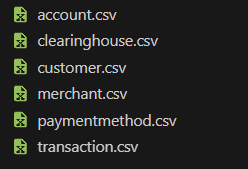
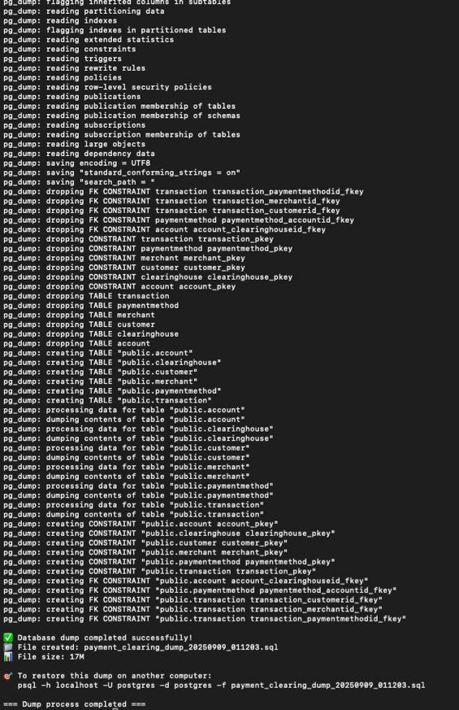

# Payment Clearing System Database

**Student IDs:** 215863135, 216252031

---

## 📊 Stage 1 - Database Design and Creation

### Project Overview

This project creates a Payment Clearing System database that manages the full process of financial transactions, from the moment they start until settlement. The system supports multiple payment methods, works with different clearing houses, and keeps complete transaction records.

### Why This Domain?

Payment clearing systems are critical infrastructure in modern finance, handling billions of transactions daily. Our design addresses real-world challenges:
- **Multi-network support** - Different payment types use different clearing processes
- **Compliance** - Full history and records for regulations
- **Scalability** - Can manage very large numbers of transactions
- **International support** - Works with different currencies and cross-border payments

---

## 🏗️ Database Design

### Entity-Relationship Model

The system has **6 entities** built using proper normalization (3NF):

#### 1. **Customer** - Transaction Initiators
```
CustomerID (PK, INT) - Unique ID
Name (VARCHAR) - Full name
Email (VARCHAR) - Contact details
MinimalDetails (VARCHAR) - Extra info
DateCreated (DATE) - When account was created
```
**Purpose:** Represents people or companies making payments. The creation date helps analyze customer activity and detect fraud.

#### 2. **Transaction** - Core Business Process
```
TransactionID (PK, INT) - Unique ID
Amount (INT) - Value in cents
Currency (VARCHAR) - Currency code (USD, EUR, etc.)
Status (VARCHAR) - Transaction status
TransactionDate (DATE) - When it started
SettlementDate (DATE) - When it finished
CustomerID (FK) - Links to customer
MerchantID (FK) - Links to merchant
PaymentMethodID (FK) - Links to payment method
```
**Purpose:** Records each transaction. Both dates are important to study settlement speed and for reports.

#### 3. **Merchant** - Transaction Recipients
```
MerchantID (PK, INT) - Unique ID
MerchantName (VARCHAR) - Business name
Address (VARCHAR) - Business address
```
**Purpose:** Companies that receive transactions. Their location helps analyze risks and regional activity.

#### 4. **PaymentMethod** - Payment Instruments
```
PaymentMethodID (PK, INT) - Unique ID
Type (VARCHAR) - Payment type (Credit Card, ACH, etc.)
Description (VARCHAR) - Details about the method
AccountID (FK) - Connected account
```
**Purpose:** Represents the type of payment. It connects to accounts for processing.

#### 5. **Account** - Financial Accounts
```
AccountID (PK, INT) - Unique ID
BankName (VARCHAR) - Bank name
AccountNumber (VARCHAR) - Account number
AccountType (VARCHAR) - Type of account
ClearingHouseID (FK) - Connected clearing house
```
**Purpose:** Represents financial accounts. The link to clearing houses makes routing possible.

#### 6. **ClearingHouse** - Payment Networks
```
ClearingHouseID (PK, INT) - Unique ID
Name (VARCHAR) - Network name (ACH, SWIFT, etc.)
NetworkType (VARCHAR) - Type of network
```
**Purpose:** Networks that process payments (ACH, SWIFT, etc.).

---

### Visual Schema Representation

#### ER Diagram:


The ERD shows the logical relationships between entities:
- **Customer → Transactions** : One-to-Many (customers can have multiple transactions)
- **Merchant → Transactions** : One-to-Many (merchants receive multiple payments)
- **PaymentMethod → Transactions** : One-to-Many (payment methods used in multiple transactions)
- **PaymentMethod → Account** : Many-to-One (multiple payment methods can link to one account)
- **ClearingHouse → Account** : One-to-Many (clearing houses manage multiple accounts)

#### DS Diagram:


---

## 📈 Data Generation Strategy

### Why Realistic Data?
A payment system needs realistic data to:
- Test performance under real-world loads
- Validate business logic with edge cases
- Support analysis and reports
- Meet audit and compliance needs

### Implementation Approach

We used **Python scripts** to create the data and make sure that:
- **Relationships are realistic** – Settlement dates always come after transaction dates  
- **Business rules are followed** – Transaction amounts and frequencies make sense  
- **Data is consistent** – All foreign key links are correct  
- **It can scale** – Large datasets can be generated quickly and efficiently  

We create the python script that will generate all the data and records for the tables.  
See the generator script here: [DataGenerator.py](Stage_1/DataGenerator.py)

We run the script with te following command:

```bash
python3 DataGenerator.py
```

**Output:**

```
=== PAYMENT CLEARING DATA GENERATOR ===
Creating 200,000+ transaction records...

Creating ClearingHouse data...
✓ Created 7 ClearingHouse records
Creating Account data...
✓ Created 2000 Account records
Creating PaymentMethod data...
✓ Created 1000 PaymentMethod records
Creating Customer data...
  Generated 10000 customers...
  Generated 20000 customers...
  Generated 30000 customers...
  Generated 40000 customers...
  Generated 50000 customers...
  Generated 60000 customers...
✓ Created 60000 Customer records
Creating Merchant data...
  Generated 5000 merchants...
  Generated 10000 merchants...
  Generated 15000 merchants...
✓ Created 15000 Merchant records
Creating Transaction data - MAIN BUSINESS PROCESS...
  Generated 25000 transactions...
  Generated 50000 transactions...
  Generated 75000 transactions...
  Generated 100000 transactions...
  Generated 125000 transactions...
  Generated 150000 transactions...
  Generated 175000 transactions...
  Generated 200000 transactions...
✓ Created 200000 Transaction records

=== SUMMARY ===
ClearingHouse: 7
Account: 2,000
PaymentMethod: 1,000
Customer: 60,000
Merchant: 15,000
Transaction: 200,000 MAIN PROCESS
TOTAL: 278,007 records

Files created:
• clearinghouse.csv
• account.csv
• paymentmethod.csv
• customer.csv
• merchant.csv
• transaction.csv

 Ready to import into your PostgreSQL database!
```

And here is the generated data file:



### Generated Dataset Statistics

| Entity | Records | Purpose |
|--------|---------|---------|
| **ClearingHouse** | 7 | Major payment networks (ACH, SWIFT, Visa, etc.) |
| **Account** | 2,000 | Bank accounts across major institutions |
| **PaymentMethod** | 1,000 | Various payment instruments |
| **Customer** | 60,000 | Individual and business customers |
| **Merchant** | 15,000 | Businesses receiving payments |
| **Transaction** | **200,000** | **Main business process** |
| **TOTAL** | **278,007** | Complete dataset |

#### Transaction Distribution Analysis
- **60%** Small transactions ($1-$100) - Daily consumer purchases
- **25%** Medium transactions ($100-$1,000) - Business payments
- **15%** Large transactions ($1,000-$50,000) - Corporate transfers

#### Status Distribution
- **60%** Settled - Successfully processed
- **25%** Cleared - In clearing process  
- **10%** Pending/Failed/Cancelled - Various processing states

---

## 🔧 Database Implementation

### SQL Schema Creation

The tables for the system were created using SQL scripts found here: [CreateTables.sql](Stage_1/CreateTables.sql)  
This script contains all necessary constraints, keys, and relationships for the database.

### Data Insertion

After generating the data, the records were added to the tables using pgAdmin’s Import feature.
This method directly imports the CSV files into the appropriate tables using pgAdmin's graphical interface.

### Database Dump

To back up the full database, we used the following dump script: [DumpDatabase.sh](Stage_1/DumpDatabase.sh)  
Here is an example of typical output after running the dump process:



---

## 📊 Stage 2 - ...

Backup here...

# README – Part B (Queries, Parametrized Queries, Constraints)

## 🎯 Purpose of This Stage
The second stage focuses on creating complex queries that simulate real-world system usage, as well as implementing constraints to ensure data quality. The goal is to demonstrate that the system can meet real business needs.

==================================================
## 1. SELECT / UPDATE / DELETE Queries (Queries.sql)
==================================================

### Complex SELECT Queries

**Why are complex queries important?**
Complex queries simulate real business needs such as generating reports, analyzing user behavior, and creating insights for business decisions.

### SELECT Queries

**1. All transactions above 500, including customer and merchant details**
```sql
SELECT c.Name, m.MerchantName, t.Amount, t.Currency, t.TransactionDate
FROM Transaction t
JOIN Customer c ON t.CustomerID = c.CustomerID
JOIN Merchant m ON t.MerchantID = m.MerchantID
WHERE t.Amount > 500
ORDER BY t.TransactionDate DESC;
```
**Why this query is important:**
Identifies high-value transactions for risk management and helps detect unusual spending patterns that might require attention.

Insert screenshot here.

---

**2. Average transaction amounts per currency**
```sql
SELECT t.Currency, AVG(t.Amount) AS avgAmount, COUNT(*) AS transactionCount
FROM Transaction t
GROUP BY t.Currency
ORDER BY avgAmount DESC;
```
**Why this query is important:**
Provides insights into transaction volume distribution per currency and helps in financial planning and currency exchange rate analysis.

Insert screenshot here.

---

**3. Customers with transactions above 1000 in the last year**
```sql
SELECT c.Name, c.Email, SUM(t.Amount) AS totalAmount
FROM Customer c
JOIN Transaction t ON c.CustomerID = t.CustomerID
WHERE t.TransactionDate >= CURRENT_DATE - INTERVAL '1 year'
GROUP BY c.CustomerID
HAVING SUM(t.Amount) > 1000;
```
**Why this query is important:**
Identifies high-value customers for loyalty programs and targeted marketing campaigns, helping improve customer retention.

Insert screenshot here.

---

**4. Bank accounts with more than two payment methods**
```sql
SELECT a.BankName, a.AccountNumber, COUNT(pm.PaymentMethodID) AS paymentMethodCount
FROM Account a
JOIN PaymentMethod pm ON a.AccountID = pm.AccountID
GROUP BY a.AccountID
HAVING COUNT(pm.PaymentMethodID) > 2;
```
**Why this query is important:**
Detects accounts with multiple payment methods, which is relevant for risk management and fraud prevention.

Insert screenshot here.

---

**5. Transaction count per currency**
```sql
SELECT Currency, COUNT(*) AS cnt
FROM Transaction
GROUP BY Currency
ORDER BY cnt DESC;
```
**Why this query is important:**
Provides a quick overview of transaction volume per currency, essential for business intelligence and market analysis.

Insert screenshot here.

### Data Modification Operations

#### DELETE Operations

**Why is deleting old data important?**
Deleting old and irrelevant data improves performance, saves storage space, and maintains compliance with privacy regulations like GDPR.

**1. Delete cancelled transactions**
```sql
DELETE FROM Transaction WHERE Status = 'Cancelled';
```
**Why this deletion is necessary:**
Cancelled transactions clutter the database and can skew analytics. Removing them improves query performance and data accuracy.

- Before: Insert screenshot here
- After: Insert screenshot here

---

**2. Delete failed transactions**
```sql
DELETE FROM Transaction WHERE Status = 'Failed';
```
**Why this deletion is necessary:**
Failed transactions from system errors should be cleaned up to avoid confusion in financial reports and maintain data integrity.

- Before: Insert screenshot here
- After: Insert screenshot here

#### UPDATE Operations

**Why is updating data important?**
Data updates ensure that information in the system is always current and accurate, which is crucial for making correct business decisions.

**1. Update transactions from 'Pending' to 'Completed'**
```sql
UPDATE Transaction SET Status = 'Completed' WHERE Status = 'Pending';
```
**Why this update is important:**
Transactions that have been processed but still marked as "Pending" could cause unjustified service blocking for customers.

- Before: Insert screenshot here
- After: Insert screenshot here

---

**2. Update transaction currency from EUR to ILS**
```sql
UPDATE Transaction SET Currency = 'ILS' WHERE Currency = 'EUR';
```
**Why this update is important:**
Standardizing transactions to local currency simplifies financial reporting and reduces complexity in currency conversion calculations.

- Before: Insert screenshot here
- After: Insert screenshot here

### Transaction Control

#### Rollback Demonstration
**Why is Rollback important?**
Rollback allows canceling changes in case of errors or issues, ensuring data integrity and allowing safe testing of operations.

For testing purposes, queries can be wrapped with:
```sql
BEGIN;
-- run queries
ROLLBACK;
```

- During Rollback: Insert screenshot here
- After Rollback: Insert screenshot here

==================================================
## 2. Parametrized Queries (ParamsQueries.sql)
==================================================

We created **4 parametrized queries** that simulate real user questions requiring input parameters.

**Why are parametrized queries important?**
They provide flexibility for users to get specific information based on their needs, making the system more interactive and useful.

### The 4 Parametrized Queries:

**1. Show all transactions for a specific customer by name**
- **Business Question:** "Show me all transactions for customer John Doe"
- **Parameter:** Customer Name (e.g., 'John Smith')
- **Uses:** JOIN, ORDER BY
- **Purpose:** Retrieves all transaction details for a given customer, including merchant and payment method, allowing focused analysis on individual customer behavior.

**2. Show transactions within a date range and minimum amount**
- **Business Question:** "Show me all transactions between two dates with amount above threshold"
- **Parameters:** Start Date = '2024-01-01', End Date = '2024-12-31', Minimum Amount = 100
- **Uses:** JOIN, WHERE with date range and minimum amount, ORDER BY
- **Purpose:** Filters transactions to a specific period and threshold, useful for reporting and detecting significant transactions over time.

**3. Merchant transaction summary**
- **Business Question:** "Give me transaction summary for merchant example 'Amazon' in 'USD'"
- **Parameters:** Merchant Name = 'Amazon', Currency = 'USD'
- **Uses:** JOIN, GROUP BY, SUM/AVG/MAX/MIN functions
- **Purpose:** Aggregates all transactions for a merchant in a given currency, showing total, average, highest, and lowest transaction amounts. Useful for merchant performance analysis.

**4. Payment methods usage by bank and account type**
- **Business Question:** "Show payment method usage for bank example 'Bank Hapoalim' and 'Checking' accounts"
- **Parameters:** Bank Name = 'Bank Hapoalim', Account Type = 'Checking'
- **Uses:** JOIN, GROUP BY, COUNT/SUM functions
- **Purpose:** Provides insights into payment method usage per bank and account type, supporting financial analysis and operational decisions.

### Execution Results:
Insert screenshot/log here showing sample execution with parameters.

### Performance Timing:
Each query was executed with `EXPLAIN ANALYZE` to measure performance:
Insert timing results here.

==================================================
## 3. Constraints & Indexes (Constraints.sql)
==================================================

### Database Constraints

**Why are constraints important?**
Constraints ensure that data entering the system is valid and consistent, preventing incorrect data that could damage system reliability.

### Indexes Created:
- `idx_transaction_date` on TransactionDate - improves date-range queries
- `idx_transaction_currency` on Currency - speeds up currency-based filtering
- `idx_customer_name` on Customer Name - accelerates customer searches

### Constraints Added:

**1. Transaction amount cannot be negative**
```sql
ALTER TABLE Transaction
ADD CONSTRAINT chk_amount_positive CHECK (Amount >= 0);
```
**Why this constraint is essential:**
Negative payments are illogical and could indicate errors in the payment system.

Insert screenshot here.

---

**2. Transaction status must be from specific list**
```sql
ALTER TABLE Transaction
ADD CONSTRAINT chk_status_values CHECK (Status IN ('Pending', 'Completed', 'Failed', 'Cancelled'));
```
**Why this constraint is essential:**
Limiting statuses to defined values prevents typos and ensures consistency in reports.

Insert screenshot here.

---

**3. Currency must be from approved list**
```sql
ALTER TABLE Transaction
ADD CONSTRAINT chk_currency_values CHECK (Currency IN ('USD', 'EUR', 'ILS', 'GBP'));
```
**Why this constraint is essential:**
Ensures only supported currencies are used, preventing integration issues with payment processors.

Insert screenshot here.

---

**4. Customer email addresses must be unique**
```sql
ALTER TABLE Customer
ADD CONSTRAINT uk_customer_email UNIQUE (Email);
```
**Why this constraint is essential:**
Prevents duplicate customer accounts and ensures proper customer identification.

Insert screenshot here.

---

**5. Default value for customer creation date**
```sql
ALTER TABLE Customer
ALTER COLUMN DateCreated SET DEFAULT CURRENT_DATE;
```
**Why this default is essential:**
Ensures every customer has a creation date for analytics and compliance tracking.

Insert screenshot here.

### Constraint Violation Tests

Testing the constraints with invalid data:

**Test 1: Try to insert negative amount (should fail)**
```sql
-- This should fail due to chk_amount_positive
INSERT INTO Transaction (TransactionID, Amount, Currency, Status, TransactionDate, CustomerID, MerchantID, PaymentMethodID)
VALUES ('TXN999', -100.00, 'USD', 'Pending', CURRENT_DATE, 'CUST001', 'MERCH001', 'PAY001');
```
Insert error message screenshot here.

**Test 2: Try to insert invalid status (should fail)**
```sql
-- This should fail due to chk_status_values
INSERT INTO Transaction (TransactionID, Amount, Currency, Status, TransactionDate, CustomerID, MerchantID, PaymentMethodID)
VALUES ('TXN998', 100.00, 'USD', 'Invalid Status', CURRENT_DATE, 'CUST001', 'MERCH001', 'PAY001');
```
Insert error message screenshot here.

**Test 3: Try to insert duplicate email (should fail)**
```sql
-- This should fail due to uk_customer_email
INSERT INTO Customer (CustomerID, Name, Email, MinimalDetails, DateCreated) 
VALUES ('CUST999', 'Test User', 'existing@email.com', 'Test Details', CURRENT_DATE);
```
Insert error message screenshot here.

### Performance Improvement Tests

**Before and after index creation:**
Using `EXPLAIN ANALYZE` to show performance improvements:

```sql
-- Test TransactionDate index performance
EXPLAIN ANALYZE SELECT * FROM Transaction 
WHERE TransactionDate BETWEEN '2024-01-01' AND '2024-12-31';
```
Insert timing comparison here (before/after index).

==================================================
## 4. Files Structure
==================================================

- **[Queries.sql](Queries.sql)** - All SELECT, UPDATE, DELETE queries
- **[ParamsQueries.sql](ParamsQueries.sql)** - Parametrized queries for user input
- **[Constraints.sql](Constraints.sql)** - Database constraints and indexes definitions

==================================================
