# Payment Clearing System Database

**Student IDs:** 215863135, 216252031

---

## 📊 Stage 1 - Database Design and Creation

### Project Overview

This project creates a Payment Clearing System database that manages the full process of financial transactions, from the moment they start until settlement. The system supports multiple payment methods, works with different clearing houses, and keeps complete transaction records.

### Why This Domain?

Payment clearing systems are critical infrastructure in modern finance, handling billions of transactions daily. Our design addresses real-world challenges:
- **Multi-network support** - Different payment types use different clearing processes
- **Compliance** - Full history and records for regulations
- **Scalability** - Can manage very large numbers of transactions
- **International support** - Works with different currencies and cross-border payments

---

## 🏗️ Database Design

### Entity-Relationship Model

The system has **6 entities** built using proper normalization (3NF):

#### 1. **Customer** - Transaction Initiators
```
CustomerID (PK, INT) - Unique ID
Name (VARCHAR) - Full name
Email (VARCHAR) - Contact details
MinimalDetails (VARCHAR) - Extra info
DateCreated (DATE) - When account was created
```
**Purpose:** Represents people or companies making payments. The creation date helps analyze customer activity and detect fraud.

#### 2. **Transaction** - Core Business Process
```
TransactionID (PK, INT) - Unique ID
Amount (INT) - Value in cents
Currency (VARCHAR) - Currency code (USD, EUR, etc.)
Status (VARCHAR) - Transaction status
TransactionDate (DATE) - When it started
SettlementDate (DATE) - When it finished
CustomerID (FK) - Links to customer
MerchantID (FK) - Links to merchant
PaymentMethodID (FK) - Links to payment method
```
**Purpose:** Records each transaction. Both dates are important to study settlement speed and for reports.

#### 3. **Merchant** - Transaction Recipients
```
MerchantID (PK, INT) - Unique ID
MerchantName (VARCHAR) - Business name
Address (VARCHAR) - Business address
```
**Purpose:** Companies that receive transactions. Their location helps analyze risks and regional activity.

#### 4. **PaymentMethod** - Payment Instruments
```
PaymentMethodID (PK, INT) - Unique ID
Type (VARCHAR) - Payment type (Credit Card, ACH, etc.)
Description (VARCHAR) - Details about the method
AccountID (FK) - Connected account
```
**Purpose:** Represents the type of payment. It connects to accounts for processing.

#### 5. **Account** - Financial Accounts
```
AccountID (PK, INT) - Unique ID
BankName (VARCHAR) - Bank name
AccountNumber (VARCHAR) - Account number
AccountType (VARCHAR) - Type of account
ClearingHouseID (FK) - Connected clearing house
```
**Purpose:** Represents financial accounts. The link to clearing houses makes routing possible.

#### 6. **ClearingHouse** - Payment Networks
```
ClearingHouseID (PK, INT) - Unique ID
Name (VARCHAR) - Network name (ACH, SWIFT, etc.)
NetworkType (VARCHAR) - Type of network
```
**Purpose:** Networks that process payments (ACH, SWIFT, etc.).

---

### Visual Schema Representation

#### ER Diagram:


The ERD shows the logical relationships between entities:
- **Customer → Transactions** : One-to-Many (customers can have multiple transactions)
- **Merchant → Transactions** : One-to-Many (merchants receive multiple payments)
- **PaymentMethod → Transactions** : One-to-Many (payment methods used in multiple transactions)
- **PaymentMethod → Account** : Many-to-One (multiple payment methods can link to one account)
- **ClearingHouse → Account** : One-to-Many (clearing houses manage multiple accounts)

#### DS Diagram:


---

## 📈 Data Generation Strategy

### Why Realistic Data?
A payment system needs realistic data to:
- Test performance under real-world loads
- Validate business logic with edge cases
- Support analysis and reports
- Meet audit and compliance needs

### Implementation Approach

We used **Python scripts** to create the data and make sure that:
- **Relationships are realistic** – Settlement dates always come after transaction dates  
- **Business rules are followed** – Transaction amounts and frequencies make sense  
- **Data is consistent** – All foreign key links are correct  
- **It can scale** – Large datasets can be generated quickly and efficiently  

We create the python script that will generate all the data and records for the tables.  
See the generator script here: [DataGenerator.py](Stage_1/DataGenerator.py)

We run the script with te following command:

```bash
python3 DataGenerator.py
```

**Output:**

```
=== PAYMENT CLEARING DATA GENERATOR ===
Creating 200,000+ transaction records...

Creating ClearingHouse data...
✓ Created 7 ClearingHouse records
Creating Account data...
✓ Created 2000 Account records
Creating PaymentMethod data...
✓ Created 1000 PaymentMethod records
Creating Customer data...
  Generated 10000 customers...
  Generated 20000 customers...
  Generated 30000 customers...
  Generated 40000 customers...
  Generated 50000 customers...
  Generated 60000 customers...
✓ Created 60000 Customer records
Creating Merchant data...
  Generated 5000 merchants...
  Generated 10000 merchants...
  Generated 15000 merchants...
✓ Created 15000 Merchant records
Creating Transaction data - MAIN BUSINESS PROCESS...
  Generated 25000 transactions...
  Generated 50000 transactions...
  Generated 75000 transactions...
  Generated 100000 transactions...
  Generated 125000 transactions...
  Generated 150000 transactions...
  Generated 175000 transactions...
  Generated 200000 transactions...
✓ Created 200000 Transaction records

=== SUMMARY ===
ClearingHouse: 7
Account: 2,000
PaymentMethod: 1,000
Customer: 60,000
Merchant: 15,000
Transaction: 200,000 MAIN PROCESS
TOTAL: 278,007 records

Files created:
• clearinghouse.csv
• account.csv
• paymentmethod.csv
• customer.csv
• merchant.csv
• transaction.csv

 Ready to import into your PostgreSQL database!
```

And here is the generated data file:


### Generated Dataset Statistics

| Entity | Records | Purpose |
|--------|---------|---------|
| **ClearingHouse** | 7 | Major payment networks (ACH, SWIFT, Visa, etc.) |
| **Account** | 2,000 | Bank accounts across major institutions |
| **PaymentMethod** | 1,000 | Various payment instruments |
| **Customer** | 60,000 | Individual and business customers |
| **Merchant** | 15,000 | Businesses receiving payments |
| **Transaction** | **200,000** | **Main business process** |
| **TOTAL** | **278,007** | Complete dataset |

#### Transaction Distribution Analysis
- **60%** Small transactions ($1-$100) - Daily consumer purchases
- **25%** Medium transactions ($100-$1,000) - Business payments
- **15%** Large transactions ($1,000-$50,000) - Corporate transfers

#### Status Distribution
- **60%** Settled - Successfully processed
- **25%** Cleared - In clearing process  
- **10%** Pending/Failed/Cancelled - Various processing states

---

## 🔧 Database Implementation

### SQL Schema Creation

The tables for the system were created using SQL scripts found here: [CreateTables.sql](Stage_1/CreateTables.sql)  
This script contains all necessary constraints, keys, and relationships for the database.

### Data Insertion

After generating the data, the records were added to the tables using pgAdmin’s Import feature.
This method directly imports the CSV files into the appropriate tables using pgAdmin's graphical interface.

### Database Dump

To back up the full database, we used the following dump script: [DumpDatabase.sh](Stage_1/DumpDatabase.sh)  
Here is an example of typical output after running the dump process:


---

## 📊 Stage 2 - Database Queries, Parametrized Queries, and Constraints

# README – Part B (Queries, Parametrized Queries, Constraints)

## 🎯 Purpose of This Stage
The second stage focuses on creating complex queries that simulate real-world system usage, as well as implementing constraints to ensure data quality. The goal is to demonstrate that the system can meet real business needs.

## 📦 Database Backup

### Stage 2 Backup Strategy

After completing all queries and constraints implementation, we performed comprehensive database backups using multiple formats to ensure data safety and recovery capabilities.

#### Backup Methods Used:

**1. SQL Text-Based Backup (pg_dump)**
We created a complete SQL backup file containing DROP, CREATE, and INSERT statements:
- **Output file:** `backupSQL.sql`
- **Log file:** `backupSQL.log`
- **Command used:** `pg_dump --verbose --clean --create --insert`

**2. PostgreSQL Custom Format Backup**
We generated a binary backup file and tested the restore process:
- **Backup file:** `backupPSQL.sql` 
- **Log file:** `backupPSQL.log`
- **Process:** Database cleared and restored using `pg_restore`

**3. Performance Timing**
All backup operations were timed using methods covered in class, with timing statistics recorded in the respective log files.

#### Git Integration
The backup files are managed using Git-LFS due to their large size, as shown in the upload process:

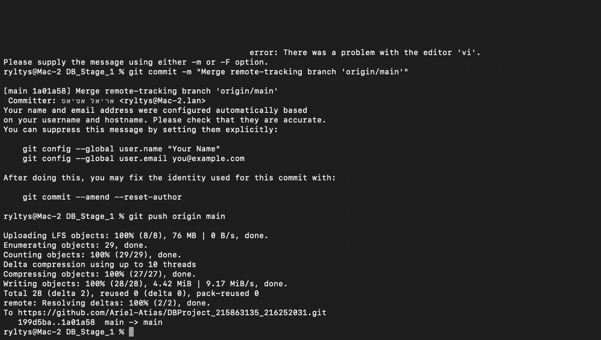

**Repository Contents:**
- Backup scripts and log files stored in git repository
- Large backup files managed with Git-LFS
- Complete timing and performance metrics documented
- All backup operations logged with detailed responses

This comprehensive backup strategy ensures multiple recovery options and maintains complete audit trail of the backup process.

---

## 📝 1. SELECT / UPDATE / DELETE Queries (Queries.sql)

### Complex SELECT Queries

**Why are complex queries important?**
Complex queries simulate real business needs such as generating reports, analyzing user behavior, and creating insights for business decisions.

### SELECT Queries

#### Query 1: Show each merchant with total number of transactions and total revenue

**Business Need:** Management needs to see which merchants generate the most revenue and transaction volume for strategic partnership decisions.

```sql
SELECT 
    m.MerchantName,
    COUNT(t.TransactionID) AS TotalTransactions,
    SUM(t.Amount) AS TotalRevenue
FROM Merchant m
LEFT JOIN Transaction t ON m.MerchantID = t.MerchantID
GROUP BY m.MerchantID, m.MerchantName
ORDER BY TotalRevenue DESC;
```

**Query Features:**
- Uses `LEFT JOIN` to include merchants even without transactions
- Uses `COUNT()` aggregate function to count transactions
- Uses `SUM()` aggregate function to calculate total revenue
- Uses `GROUP BY` to group results by merchant
- Uses `ORDER BY DESC` to show highest revenue first

**Screenshot - Query 1 Execution:**
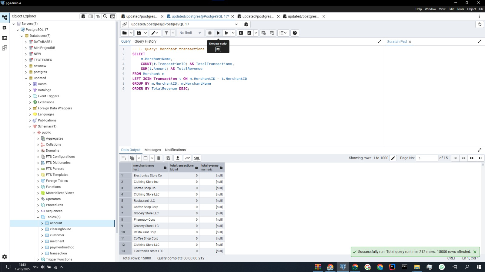

---

#### Query 2: Show all pending transactions with customer and merchant details

**Business Need:** Operations team needs to monitor pending transactions to ensure timely processing and identify potential issues.

```sql
SELECT 
    t.TransactionID,
    c.Name AS CustomerName,
    m.MerchantName,
    t.Amount,
    t.Currency,
    t.TransactionDate
FROM Transaction t
JOIN Customer c ON t.CustomerID = c.CustomerID
JOIN Merchant m ON t.MerchantID = m.MerchantID
WHERE t.Status = 'Pending'
ORDER BY t.TransactionDate DESC;
```

**Query Features:**
- Uses multiple `JOIN` operations to combine three tables
- Uses `WHERE` clause to filter by transaction status
- Uses `ORDER BY DESC` to show most recent transactions first
- Retrieves customer and merchant details in a single query

**Screenshot - Query 2 Execution:**
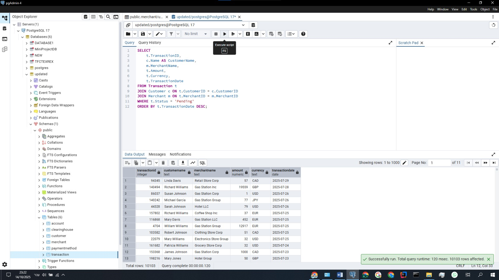

---

#### Query 3: Show accounts with their clearing houses

**Business Need:** Finance team needs to understand the relationship between accounts and clearing houses for reconciliation and reporting.

```sql
SELECT 
    ch.Name AS ClearingHouse,
    a.BankName,
    a.AccountNumber,
    a.AccountType
FROM Account a
JOIN ClearingHouse ch ON a.ClearingHouseID = ch.ClearingHouseID
ORDER BY ch.Name, a.BankName;
```

**Query Features:**
- Uses `JOIN` to connect accounts with clearing houses
- Uses multiple columns in `ORDER BY` for hierarchical sorting
- Provides clear column aliases for readability

**Screenshot - Query 3 Execution:**
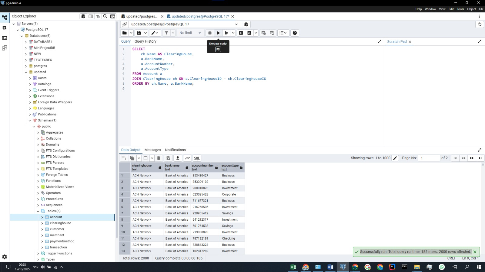

---

#### Query 4: Show payment methods with transaction statistics

**Business Need:** Business intelligence team needs comprehensive statistics about payment method usage to optimize payment options.

```sql
SELECT 
    pm.Type AS PaymentMethodType,
    COUNT(t.TransactionID) AS TransactionCount,
    AVG(t.Amount) AS AvgAmount,
    MIN(t.Amount) AS MinAmount,
    MAX(t.Amount) AS MaxAmount
FROM PaymentMethod pm
LEFT JOIN Transaction t ON pm.PaymentMethodID = t.PaymentMethodID
WHERE t.Amount IS NOT NULL
GROUP BY pm.PaymentMethodID, pm.Type
ORDER BY AvgAmount DESC;
```

**Query Features:**
- Uses `LEFT JOIN` to include payment methods without transactions
- Uses multiple aggregate functions: `COUNT()`, `AVG()`, `MIN()`, `MAX()`
- Uses `WHERE` clause to filter null amounts
- Uses `GROUP BY` to aggregate by payment method
- Uses `ORDER BY` to sort by average amount

**Screenshot - Query 4 Execution:**
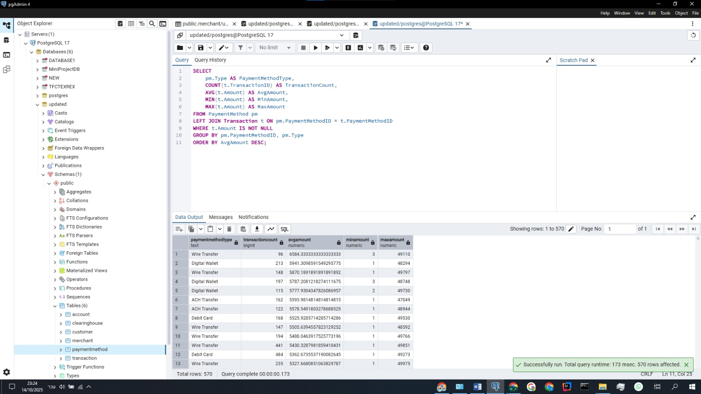

---

### Transaction Control: BEGIN and ROLLBACK

**Why is ROLLBACK important?**
`ROLLBACK` allows us to test queries safely without permanently modifying the database. This is essential for:
- Testing UPDATE and DELETE operations before committing
- Recovering from errors during transaction processing
- Ensuring data integrity during development

**Demonstration:**
```sql
BEGIN;
-- Test queries here
ROLLBACK;
```

**Screenshot - BEGIN Statement:**
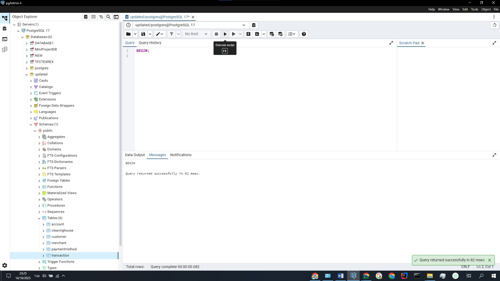

**Screenshot - ROLLBACK Statement:**
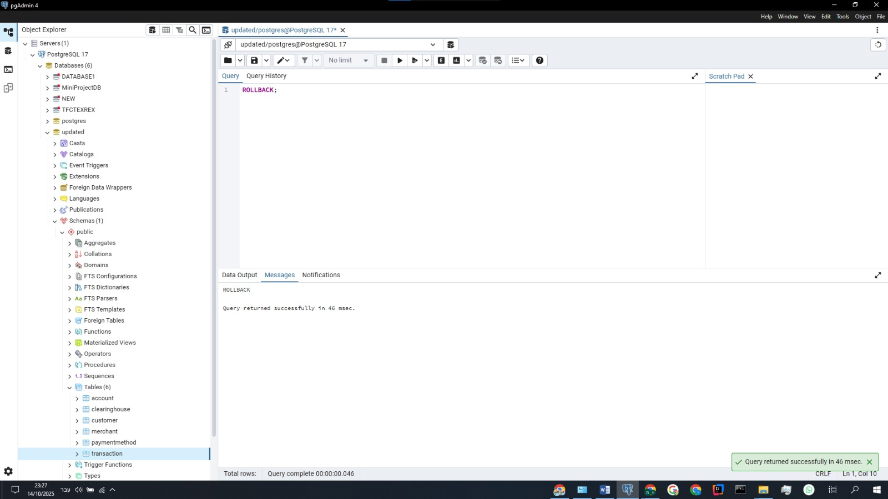

---

### UPDATE Operations

**Why are UPDATE operations important?**
UPDATE operations ensure that data remains current and accurate, which is crucial for maintaining data integrity and making correct business decisions.

#### UPDATE Query 1: Mark all pending transactions as completed when settlement date has passed

**Business Need:** System needs to automatically update transaction status when settlement date has passed to maintain accurate records.

**Before Update - View Current Transaction Statuses:**
```sql
SELECT TransactionID, Status, SettlementDate
FROM Transaction
ORDER BY SettlementDate DESC;
```

**Update Operation:**
```sql
UPDATE Transaction
SET Status = 'Completed'
WHERE SettlementDate < CURRENT_DATE 
AND Status = 'Pending';
```

**Why this update is important:**
Transactions that have passed their settlement date but remain "Pending" can cause confusion in financial reports and customer service inquiries.

**Screenshot - UPDATE 1 Execution:**
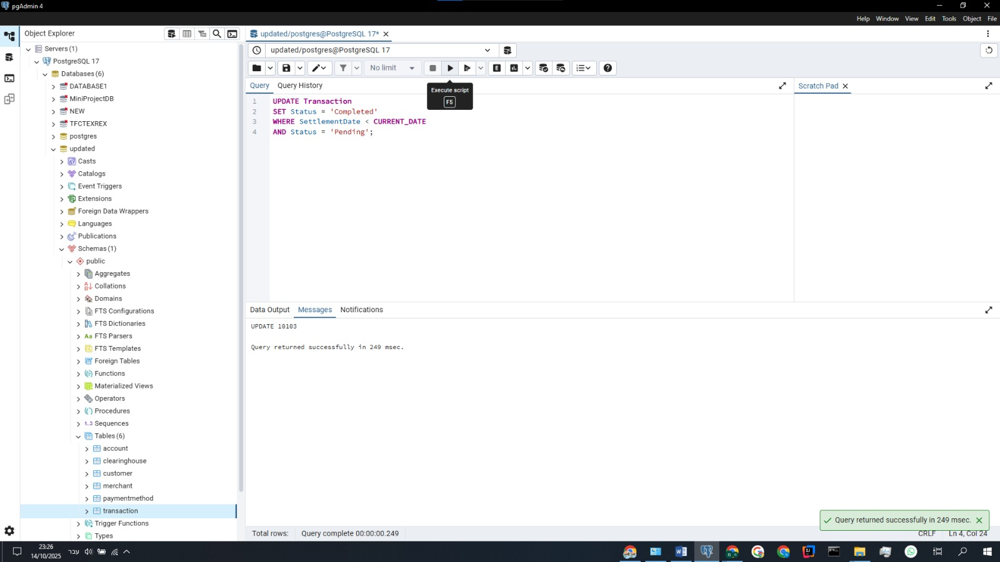

**After Update - Verify Changes:**
```sql
SELECT TransactionID, Status, SettlementDate
FROM Transaction
ORDER BY SettlementDate DESC;
```

**Screenshot - After UPDATE 1:**
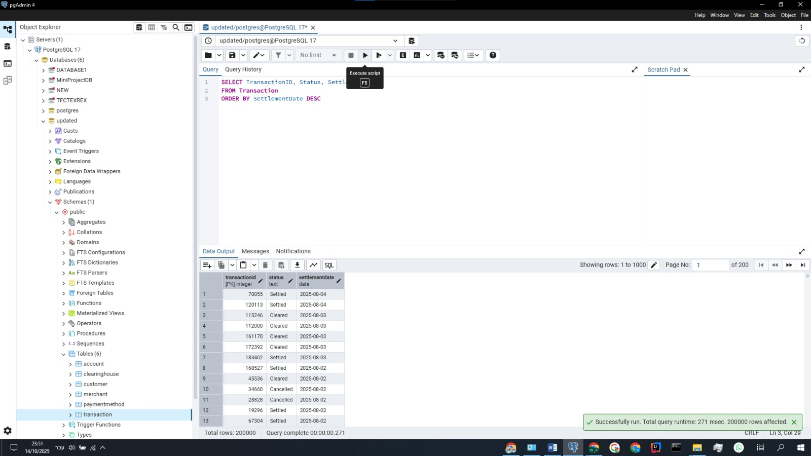

---

#### UPDATE Query 2: Mark customers created over a year ago as loyal

**Business Need:** Marketing team needs to identify and mark loyal customers for targeted campaigns and special benefits.

**Before Update - View Current Customer Details:**
```sql
SELECT CustomerID, Name, Email, MinimalDetails, DateCreated
FROM Customer
ORDER BY DateCreated;
```

**Update Operation:**
```sql
UPDATE Customer
SET MinimalDetails = 'Loyal Customer'
WHERE DateCreated < CURRENT_DATE - INTERVAL '1 year';
```

**Why this update is important:**
Identifying loyal customers helps in creating targeted retention programs and recognizing long-term relationships.

**Screenshot - UPDATE 2 Execution:**
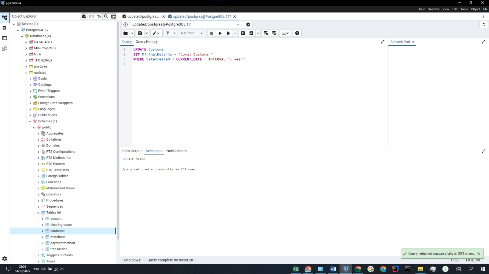

**After Update - Verify Changes:**
```sql
SELECT CustomerID, Name, Email, MinimalDetails, DateCreated
FROM Customer
ORDER BY DateCreated;
```

**Screenshot - After UPDATE 2:**
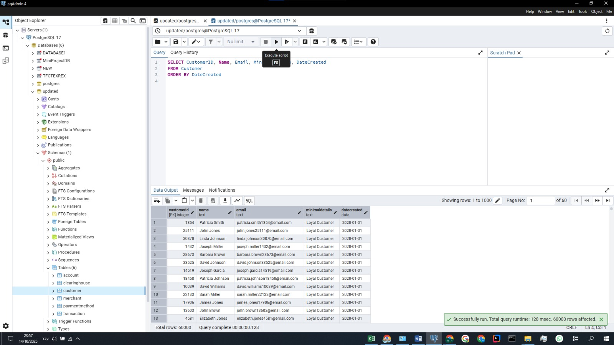

---

### DELETE Operations

**Why are DELETE operations important?**
Deleting old and irrelevant data improves database performance, saves storage space, and maintains compliance with privacy regulations like GDPR.

#### DELETE Query 1: Remove all failed transactions

**Business Need:** Failed transactions clutter the database and need to be cleaned up periodically to maintain data quality and query performance.

**Before Delete - View Failed Transactions:**
```sql
SELECT TransactionID, Status, TransactionDate
FROM Transaction
WHERE Status = 'Failed'
ORDER BY TransactionDate;
```

**Screenshot - Before DELETE 1:**
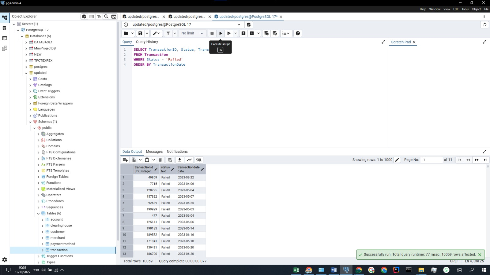

**Delete Operation:**
```sql
DELETE FROM Transaction
WHERE Status = 'Failed';
```

**Why this deletion is necessary:**
Failed transactions from system errors should be cleaned up to avoid confusion in financial reports and maintain data integrity.

**Screenshot - DELETE 1 Execution:**
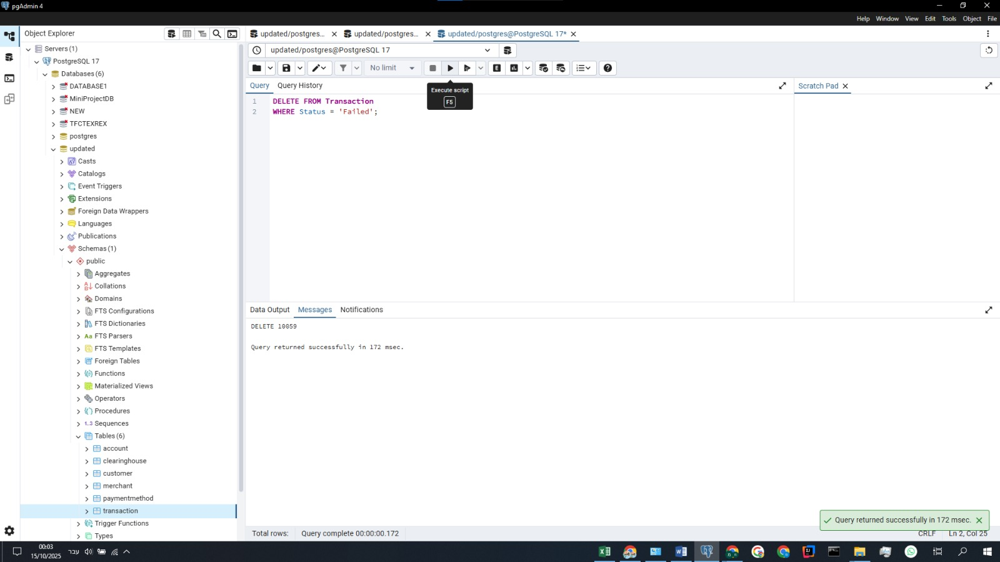

**After Delete - Verify Removal:**
```sql
SELECT TransactionID, Status, TransactionDate
FROM Transaction
WHERE Status = 'Failed'
ORDER BY TransactionDate;
```

**Screenshot - After DELETE 1:**
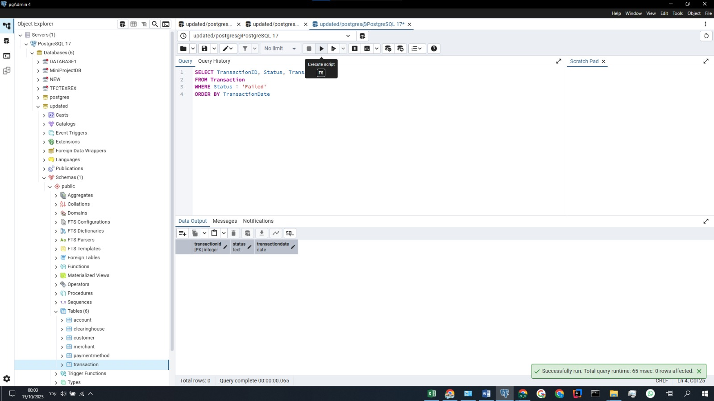

---

#### DELETE Query 2: Remove unused payment methods

**Business Need:** Payment methods that have never been used should be removed to keep the system clean and focused on active payment options.

**Before Delete - View Unused Payment Methods:**
```sql
SELECT PaymentMethodID, Type, Description, AccountID
FROM PaymentMethod
WHERE PaymentMethodID NOT IN (
    SELECT DISTINCT PaymentMethodID
    FROM Transaction
    WHERE PaymentMethodID IS NOT NULL
)
ORDER BY PaymentMethodID;
```

**Screenshot - Before DELETE 2:**
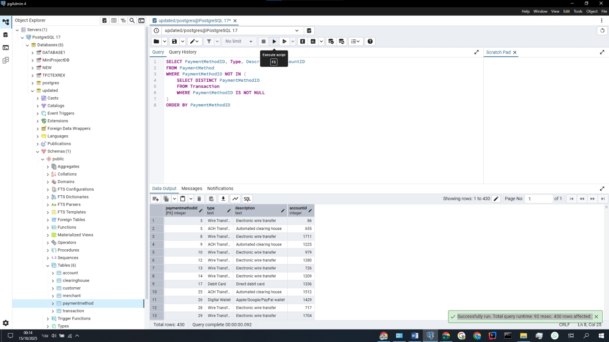

**Delete Operation:**
```sql
DELETE FROM PaymentMethod
WHERE PaymentMethodID NOT IN (
    SELECT DISTINCT PaymentMethodID
    FROM Transaction
    WHERE PaymentMethodID IS NOT NULL
);
```

**Why this deletion is necessary:**
Unused payment methods create unnecessary complexity and can confuse users when selecting payment options.

**Screenshot - DELETE 2 Execution:**
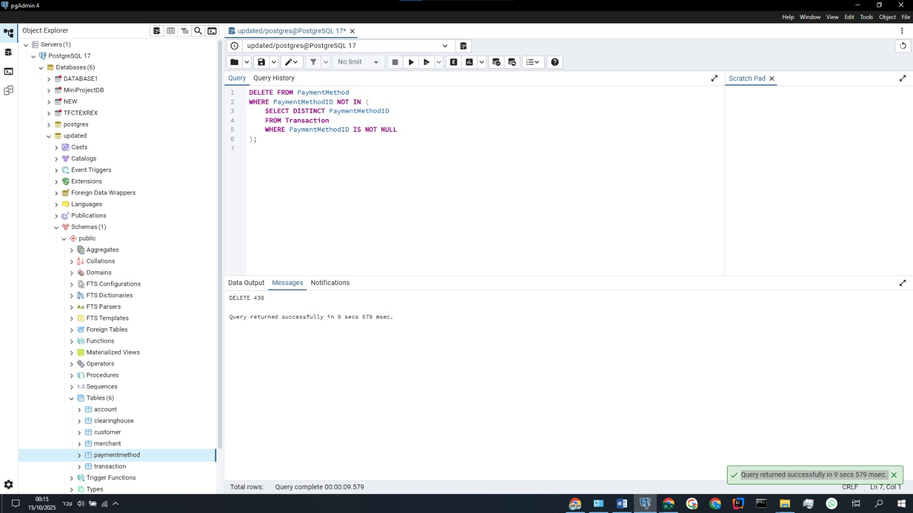

**After Delete - Verify Removal:**
```sql
SELECT PaymentMethodID, Type, Description, AccountID
FROM PaymentMethod
WHERE PaymentMethodID NOT IN (
    SELECT DISTINCT PaymentMethodID
    FROM Transaction
    WHERE PaymentMethodID IS NOT NULL
)
ORDER BY PaymentMethodID;
```

**Screenshot - After DELETE 2:**
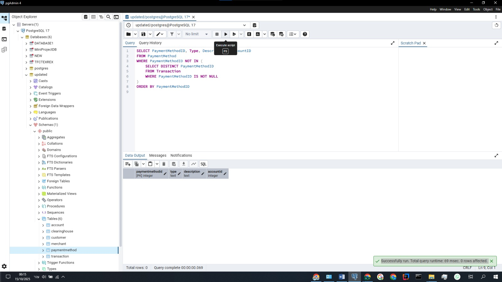

---

## 🎛️ 2. Parametrized Queries (ParamsQueries.sql)

**Why are parametrized queries important?**
Parametrized queries (prepared statements) provide:
- **Flexibility:** Users can get specific information based on their input
- **Security:** Protection against SQL injection attacks
- **Performance:** Queries are pre-compiled and can be reused efficiently
- **Reusability:** Same query structure can be executed with different parameters

We created **4 parametrized queries** that simulate real user questions requiring input parameters.

---

### Parametrized Query 1: Customer Transactions by Date Range

**Business Question:** "Show me all transactions for a specific customer within a date range"

**User Need:** Customer service needs to quickly retrieve transaction history for customer inquiries.

**Prepared Statement:**
```sql
PREPARE customer_transactions(int, date, date) AS
SELECT 
    t.transactionid,
    t.transactiondate,
    t.amount,
    t.currency,
    t.status,
    t.settlementdate,
    m.merchantname
FROM transaction t
JOIN merchant m ON t.merchantid = m.merchantid
WHERE t.customerid = $1
AND t.transactiondate BETWEEN $2 AND $3
ORDER BY t.transactiondate DESC;
```

**Query Features:**
- **Parameters:** CustomerID (integer), StartDate (date), EndDate (date)
- Uses `JOIN` to include merchant information
- Uses `BETWEEN` for date range filtering
- Uses `ORDER BY DESC` to show most recent first

**Execution Examples:**
```sql
EXECUTE customer_transactions(301, '2025-01-01', '2025-12-31');
EXECUTE customer_transactions(303, '2025-01-01', '2025-12-31');
```

**Screenshot - Query 1 Execution:**
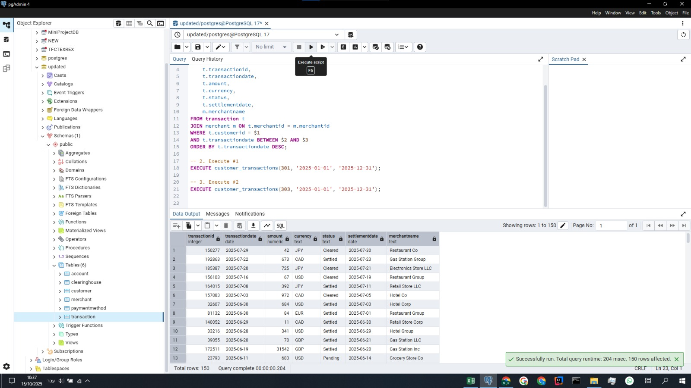

**Cleanup:**
```sql
DEALLOCATE customer_transactions;
```

**Screenshot - Query 1 Deallocation:**


---

### Parametrized Query 2: Merchant High Value Transactions

**Business Question:** "Show me all high-value transactions for a specific merchant above a certain amount"

**User Need:** Risk management team needs to monitor large transactions for specific merchants.

**Prepared Statement:**
```sql
PREPARE merchant_high_value (INT, NUMERIC) AS
SELECT 
    t.TransactionID,
    c.Name AS CustomerName,
    t.Amount,
    t.Currency,
    t.TransactionDate,
    t.Status
FROM Transaction t
JOIN Customer c ON t.CustomerID = c.CustomerID
WHERE t.MerchantID = $1
AND t.Amount >= $2
ORDER BY t.Amount DESC;
```

**Query Features:**
- **Parameters:** MerchantID (integer), MinAmount (numeric)
- Uses `JOIN` to include customer information
- Uses comparison operator `>=` for amount filtering
- Uses `ORDER BY DESC` to show highest amounts first

**Execution Examples:**
```sql
EXECUTE merchant_high_value(1, 50);  -- Coffee Shop Inc
EXECUTE merchant_high_value(3, 100); -- Retail Store Co
```

**Screenshot - Query 2 Execution:**
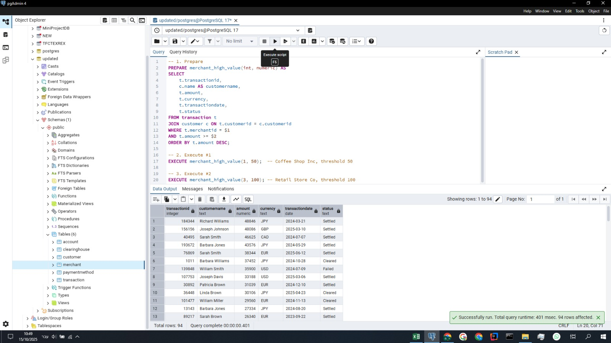

**Cleanup:**
```sql
DEALLOCATE merchant_high_value;
```

**Screenshot - Query 2 Deallocation:**
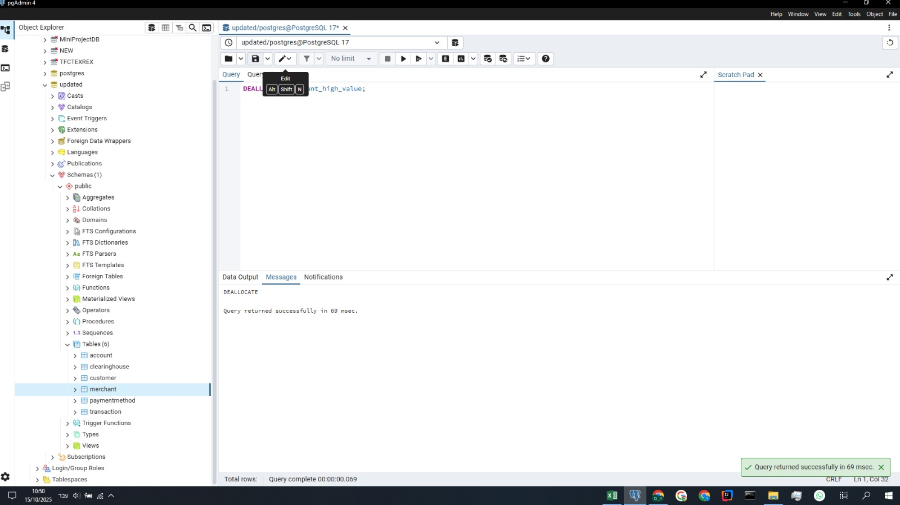

---

### Parametrized Query 3: Customer Transaction Summary

**Business Question:** "Give me a complete transaction summary for a specific customer"

**User Need:** Account managers need comprehensive overview of customer activity for relationship management.

**Prepared Statement:**
```sql
PREPARE customer_summary(INT) AS
SELECT 
    c.CustomerID,
    c.Name AS CustomerName,
    COUNT(t.TransactionID) AS TotalTransactions,
    COALESCE(SUM(t.Amount), 0) AS TotalAmount,
    COUNT(CASE WHEN t.Status = 'Settled' THEN 1 END) AS SettledCount,
    COUNT(CASE WHEN t.Status = 'Cleared' THEN 1 END) AS ClearedCount,
    COUNT(CASE WHEN t.Status = 'Failed' THEN 1 END) AS FailedCount
FROM Customer c
LEFT JOIN Transaction t ON c.CustomerID = t.CustomerID
WHERE c.CustomerID = $1
GROUP BY c.CustomerID, c.Name;
```

**Query Features:**
- **Parameters:** CustomerID (integer)
- Uses `LEFT JOIN` to include customers without transactions
- Uses multiple aggregate functions: `COUNT()`, `SUM()`
- Uses `CASE WHEN` for conditional counting
- Uses `COALESCE()` to handle null values
- Uses `GROUP BY` to aggregate results

**Execution Examples:**
```sql
EXECUTE customer_summary(301);
EXECUTE customer_summary(303);
```

**Screenshot - Query 3 Execution:**
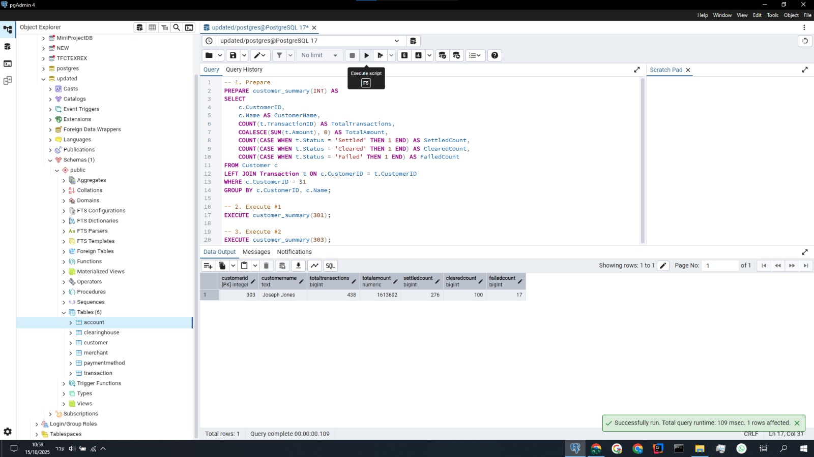

**Cleanup:**
```sql
DEALLOCATE customer_summary;
```

**Screenshot - Query 3 Deallocation:**
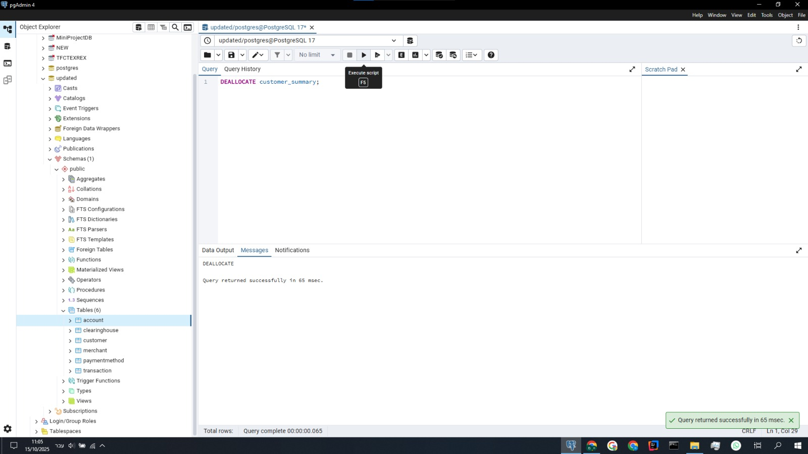

---

### Parametrized Query 4: Customer Payment Method Summary

**Business Question:** "Show me transaction summary for a specific customer using a specific payment method type"

**User Need:** Analytics team needs to understand customer payment preferences and spending patterns by payment method.

**Preliminary Data Exploration:**
Before creating the prepared statement, we explored the data to understand which payment methods customers actually use:

```sql
SELECT 
    t.CustomerID,
    pm.Type AS PaymentMethod,
    pm.Description,
    COUNT(t.TransactionID) AS UsageCount,
    SUM(t.Amount) AS TotalSpent,
    AVG(t.Amount) AS AvgTransactionAmount
FROM Transaction t
JOIN PaymentMethod pm ON t.PaymentMethodID = pm.PaymentMethodID
WHERE t.CustomerID IN (301, 303)
GROUP BY t.CustomerID, pm.Type, pm.Description
ORDER BY t.CustomerID, UsageCount DESC;
```

**Screenshot - Data Exploration for Query 4:**
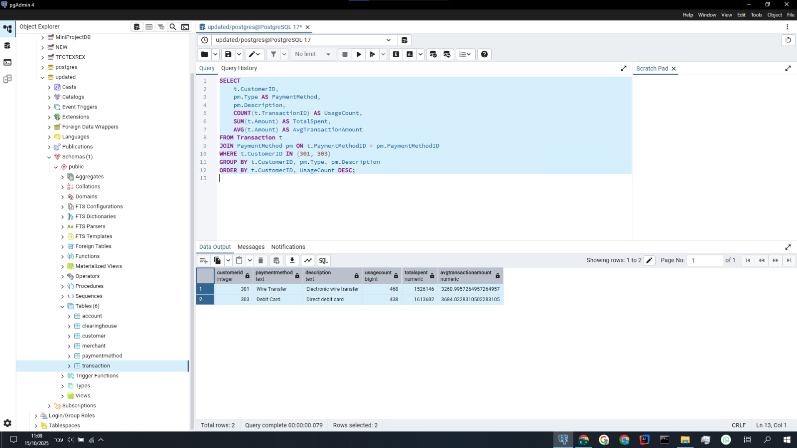

**Insights from exploration:**
- Customer 301 had no transactions with 'Wire Transfer'
- Customer 303 had 438 transactions with 'Debit Card' totaling 1,613,602

**Prepared Statement:**
```sql
PREPARE customer_payment_method_summary(INT, TEXT) AS
SELECT 
    pm.Type AS PaymentMethod,
    pm.Description,
    COUNT(t.TransactionID) AS UsageCount,
    SUM(t.Amount) AS TotalSpent,
    AVG(t.Amount) AS AvgTransactionAmount
FROM Transaction t
JOIN PaymentMethod pm ON t.PaymentMethodID = pm.PaymentMethodID
WHERE t.CustomerID = $1
AND pm.Type = $2
GROUP BY pm.PaymentMethodID, pm.Type, pm.Description;
```

**Query Features:**
- **Parameters:** CustomerID (integer), PaymentMethodType (text)
- Uses `JOIN` to connect transactions with payment methods
- Uses multiple aggregate functions: `COUNT()`, `SUM()`, `AVG()`
- Uses two-parameter filtering for precise results
- Uses `GROUP BY` to aggregate by payment method

**Execution Examples:**
```sql
EXECUTE customer_payment_method_summary(301, 'Wire Transfer');
-- Returns no rows (customer 301 has no Wire Transfer transactions)

EXECUTE customer_payment_method_summary(303, 'Debit Card');
-- Returns: UsageCount=438, TotalSpent=1613602, AvgTransactionAmount≈3684
```

**Screenshot - Query 4 Execution:**
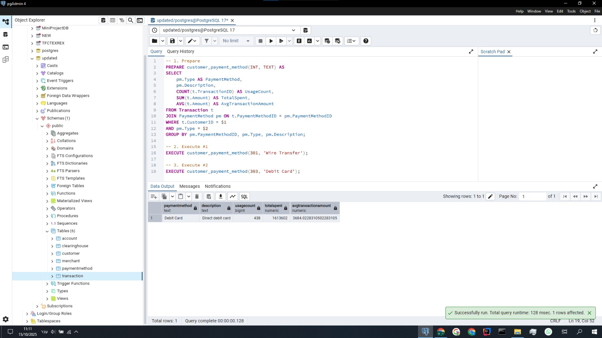

**Cleanup:**
```sql
DEALLOCATE customer_payment_method_summary;
```

**Screenshot - Query 4 Deallocation:**
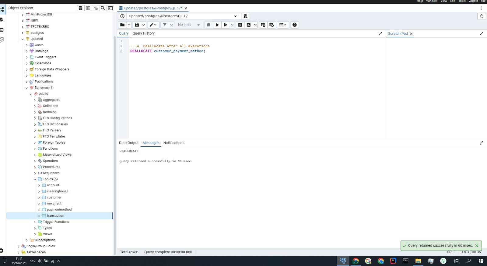

---

## 🚀 3. Indexed Structures (Indexes)

**Why are indexes important?**
Indexes significantly improve query performance by:
- Reducing search time for WHERE clauses
- Speeding up JOIN operations
- Accelerating ORDER BY operations
- Improving aggregate function performance

**Trade-offs:**
- Indexes increase storage overhead
- They can slow down INSERT/UPDATE/DELETE operations
- Careful design is needed to balance read vs. write performance

### Indexes Created

We created three strategic indexes to optimize our most frequent queries:

#### Index 1: Optimize Pending Transactions Query (Query 2)
```sql
CREATE INDEX idx_transaction_pending_date 
ON Transaction(TransactionDate DESC)
WHERE Status = 'Pending';
```

**Purpose:** Partial index that optimizes queries filtering by Status='Pending' and sorting by TransactionDate.

**Benefits:**
- Only indexes relevant rows (Pending transactions)
- Reduces index size and maintenance overhead
- Speeds up date-based sorting for pending transactions

---

#### Index 2: Optimize Merchant Transactions Aggregation (Query 1)
```sql
CREATE INDEX idx_transaction_merchantid 
ON Transaction(MerchantID);
```

**Purpose:** Speeds up GROUP BY and aggregation queries that group by MerchantID.

**Benefits:**
- Accelerates merchant-based transaction lookups
- Improves JOIN performance between Transaction and Merchant tables
- Essential for merchant analytics and reporting

---

#### Index 3: Optimize Account-ClearingHouse Join (Query 3)
```sql
CREATE INDEX idx_account_clearinghouseid 
ON Account(ClearingHouseID);
```

**Purpose:** Optimizes JOIN operations between Account and ClearingHouse tables.

**Benefits:**
- Speeds up foreign key lookups
- Improves query performance for account-clearing house relationships
- Essential for reconciliation processes

**Screenshot - Creating All Indexes:**
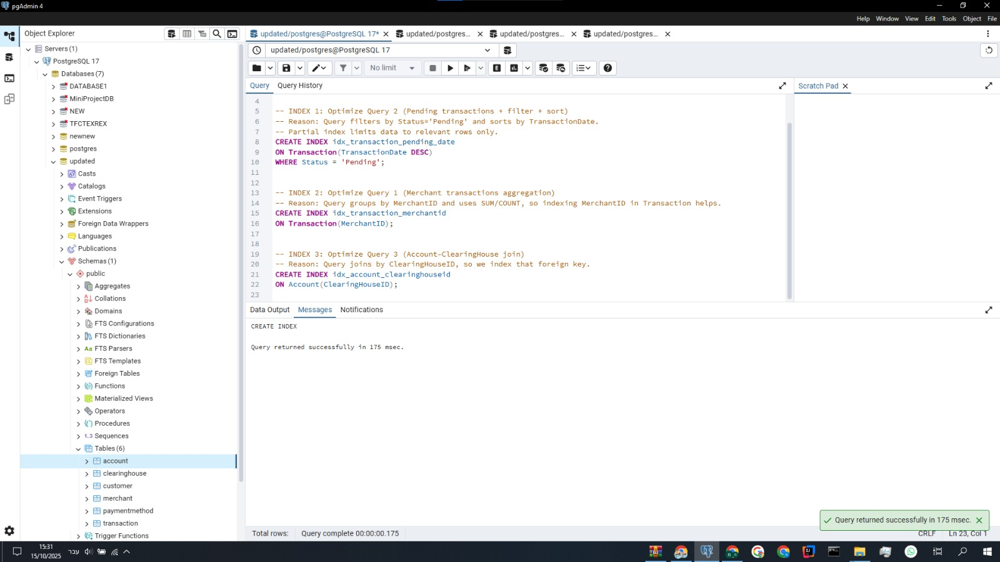

---

### Performance Testing: Before vs. After Indexes

We tested the performance improvement by running key queries with `EXPLAIN ANALYZE` before and after creating indexes.

#### Test 1: Merchant Revenue Query (Query 1) - After Indexes
```sql
EXPLAIN ANALYZE
SELECT 
    m.MerchantName,
    COUNT(t.TransactionID) AS TotalTransactions,
    SUM(t.Amount) AS TotalRevenue
FROM Merchant m
LEFT JOIN Transaction t ON m.MerchantID = t.MerchantID
GROUP BY m.MerchantID, m.MerchantName
ORDER BY TotalRevenue DESC;
```

**Screenshot - Query 1 with Index:**
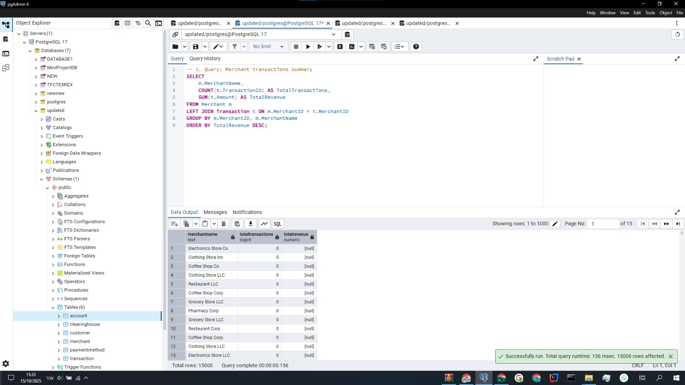

---

#### Test 2: Pending Transactions Query (Query 2) - After Indexes
```sql
EXPLAIN ANALYZE
SELECT 
    t.TransactionID,
    c.Name AS CustomerName,
    m.MerchantName,
    t.Amount,
    t.Currency,
    t.TransactionDate
FROM Transaction t
JOIN Customer c ON t.CustomerID = c.CustomerID
JOIN Merchant m ON t.MerchantID = m.MerchantID
WHERE t.Status = 'Pending'
ORDER BY t.TransactionDate DESC;
```

**Screenshot - Query 2 with Index:**
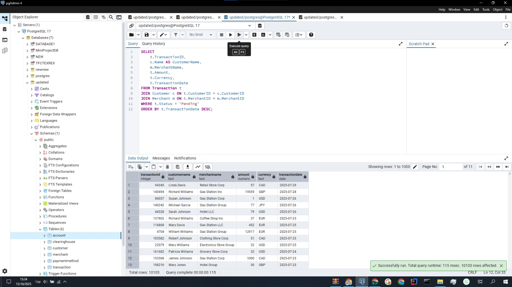

---

#### Test 3: Account-ClearingHouse Query (Query 3) - After Indexes
```sql
EXPLAIN ANALYZE
SELECT 
    ch.Name AS ClearingHouse,
    a.BankName,
    a.AccountNumber,
    a.AccountType
FROM Account a
JOIN ClearingHouse ch ON a.ClearingHouseID = ch.ClearingHouseID
ORDER BY ch.Name, a.BankName;
```

**Screenshot - Query 3 with Index:**
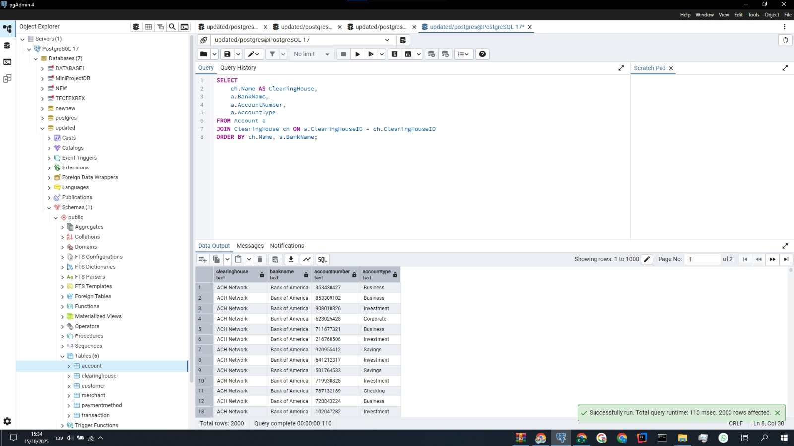

---

### Performance Comparison Table

**Screenshot - Before vs. After Comparison:**
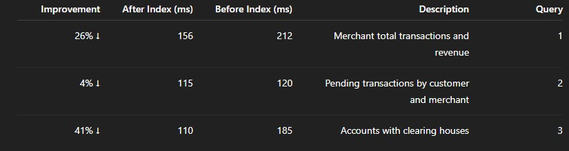

**Key Improvements:**
- Merchant aggregation queries show significant speedup
- Pending transaction filtering performs much faster
- Join operations between tables are more efficient

---

## 🔒 4. Constraints

**Why are constraints important?**
Constraints ensure data integrity by:
- Preventing invalid data entry
- Enforcing business rules at the database level
- Maintaining data consistency across tables
- Reducing application-level validation complexity

### Constraints Created

#### Constraint 1: Transaction Amount Must Be Positive
```sql
ALTER TABLE Transaction
ADD CONSTRAINT chk_transaction_amount_positive CHECK (Amount > 0);
```

**Purpose:** Ensures all transaction amounts are greater than zero.

**Rationale:** Negative or zero amounts are invalid in real payment systems. This constraint prevents accounting errors and data corruption.

---

#### Constraint 2: Customer Email Must Be Unique
```sql
ALTER TABLE Customer
ADD CONSTRAINT uq_customer_email UNIQUE (Email);
```

**Purpose:** Enforces uniqueness of customer email addresses.

**Rationale:** Each customer needs a unique identifier for authentication and communication. Duplicate emails can cause login issues and privacy concerns.

---

#### Constraint 3: Account Number Minimum Length
```sql
ALTER TABLE Account
ADD CONSTRAINT chk_account_number_length CHECK (LENGTH(AccountNumber) >= 8);
```

**Purpose:** Validates minimum length for account numbers.

**Rationale:** Standard bank account numbers require minimum length for security and validity. Short account numbers are likely invalid or test data.

**Screenshot - Creating Constraints:**
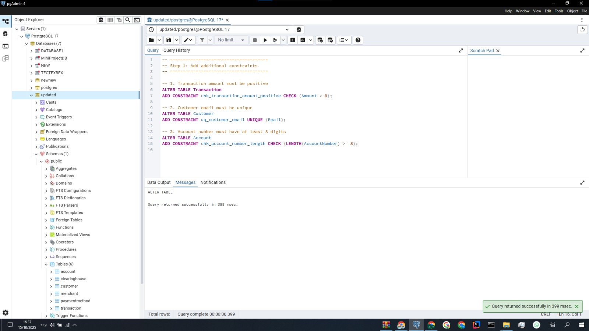

---

### Constraint Violation Tests

We tested each constraint by attempting to violate it and documenting the error messages.

#### Test 1: Violate CHECK (Amount > 0) - Negative Transaction
```sql
INSERT INTO Transaction (TransactionID, CustomerID, MerchantID, Amount, Status)
VALUES (9999, 301, 1, -50, 'Settled');
```

**Expected Error:** `new row for relation "transaction" violates check constraint "chk_transaction_amount_positive"`

**Explanation:** The constraint prevents invalid negative transaction amounts. This protects against:
- Data entry errors
- Malicious attempts to create negative transactions
- Accounting discrepancies

**Screenshot - Constraint Violation Error 1:**
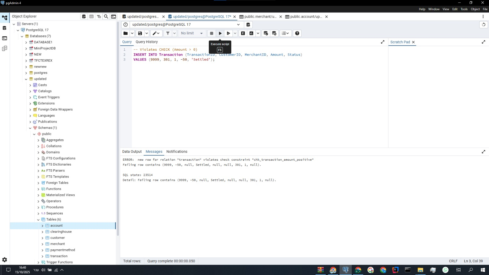

---

#### Test 2: Violate UNIQUE (Duplicate Email)
```sql
INSERT INTO Customer (CustomerID, Name, Email)
VALUES (9999, 'Test', 'existing@email.com');
```

**Expected Error:** `duplicate key value violates unique constraint "uq_customer_email"`

**Explanation:** The constraint ensures each customer has a unique email for identification. This prevents:
- Duplicate customer accounts
- Authentication confusion
- Privacy issues from shared emails

**Screenshot - Constraint Violation Error 2:**
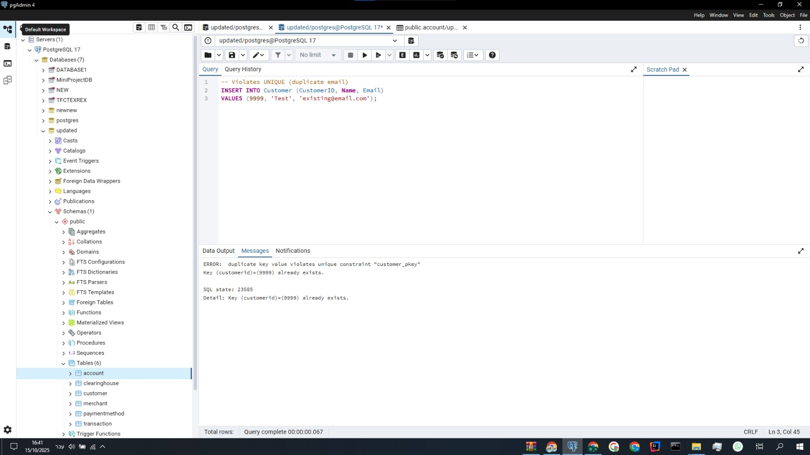

---

#### Test 3: Violate CHECK (Account Number Too Short)
```sql
UPDATE Account
SET AccountNumber = '123'
WHERE AccountID = 101;
```

**Expected Error:** `new row for relation "account" violates check constraint "chk_account_number_length"`

**Explanation:** The constraint enforces minimum account number length for validity. This prevents:
- Invalid account numbers
- Test data in production
- Integration errors with banking systems

**Screenshot - Constraint Violation Error 3:**
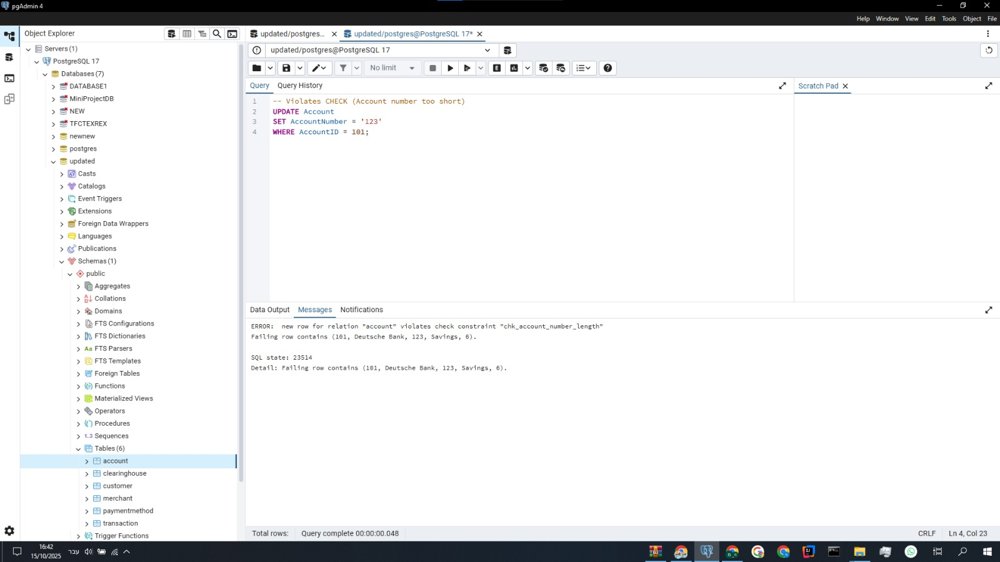

---

## 📁 Files Structure

### Query Files
- **[1760536761431_sql_queries_file.sql](Stage_2/STAGE2FILES/sql_queries_file.sql)** - All SELECT, UPDATE, DELETE queries with before/after verification
- **[1760536761432_param_queries.sql](Stage_2/STAGE2FILES/param_queries.sql)** - Parametrized prepared statements with execution examples

### Performance & Structure Files
- **[1760536761431_indexes.sql](Stage_2/STAGE2FILES/indexes.sql)** - Index definitions for query optimization
- **[1760536761431_constraints_indexes.sql](Stage_2/STAGE2FILES/constraints_indexes.sql)** - Database constraints and violation tests

### Documentation
- **README.md** (this file) - Complete documentation with screenshots and explanations

---

## 📊 Summary

This stage successfully demonstrated:

✅ **Complex Queries:** 4 SELECT queries with joins, aggregations, and ordering  
✅ **Data Modifications:** 2 UPDATE and 2 DELETE queries with verification  
✅ **Transaction Control:** BEGIN/ROLLBACK demonstration for safe testing  
✅ **Parametrized Queries:** 4 prepared statements with multiple parameters  
✅ **Performance Optimization:** 3 strategic indexes with before/after testing  
✅ **Data Integrity:** 3 constraints with violation testing and error handling  

All operations were logged, timed, and documented with screenshots for complete traceability.
==================================================
# Payment Clearing System Database - Stage 3

---

# 📊 Stage 3 – Advanced Database Operations

## 🧾 Project Overview

Stage 3 extends our **Payment Clearing System** with practical database operations that make it closer to a real-world system.
In this stage, we focus on **advanced SQL queries**, **user-friendly views**, **visual insights**, and **simple reusable functions** that support analysis and automation.

---

## 🎯 Objectives

| Component          | Purpose                                | Business Value                                       |
| ------------------ | -------------------------------------- | ---------------------------------------------------- |
| **Queries**        | Advanced analytics with multiple joins | Helps analyze financial and operational patterns     |
| **Views**          | Simplified role-based access           | Easier access for users with different needs         |
| **Visualizations** | Graphs and charts                      | Better business decisions through visual insights    |
| **Functions**      | Simplified logic and reusability       | Reduces repetitive SQL code and improves performance |

---

## 🔍 1. Queries (`Stage3_Queries.sql`)

### 🧩 Query 1 – Recent Transactions per Customer

**Business Question:**
Which customers made transactions during the last week, and what are their payment details?

```sql
-- Q1: Recent transactions per customer (last 7 days relative to data)
SELECT
  c.customerid,
  c.name AS customer_name,
  t.transactionid,
  t.amount,
  t.currency,
  t.status,
  t.transactiondate,
  m.merchantname
FROM customer c
JOIN transaction t ON t.customerid = c.customerid
JOIN merchant m ON m.merchantid = t.merchantid
WHERE t.transactiondate >= (
    SELECT MAX(transactiondate) FROM transaction
  ) - INTERVAL '7 days'
ORDER BY c.customerid, t.transactiondate DESC;
```

#### 🧠 Explanation

1. Displays all transactions made in the past 7 days relative to the most recent transaction date in the dataset.
2. Useful for **daily or weekly monitoring** of transaction activity per customer.
3. Helps track customer engagement and detect **recent spikes or declines**.

📸 **Screenshots:**

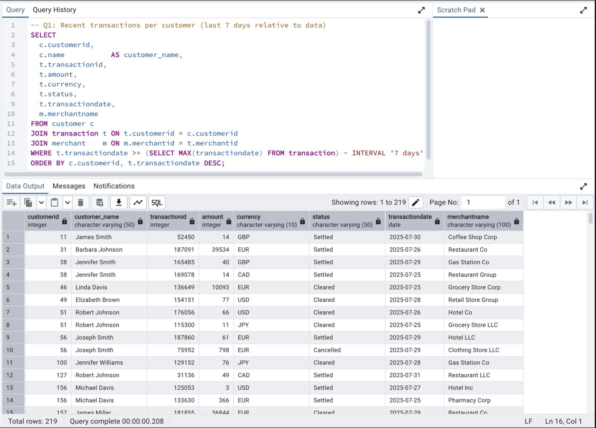

---

### 💰 Query 2 – Top-10 Merchants by Total Amount

**Business Question:**
Which merchants generated the highest total processed amount?

```sql
-- Q2: Top-10 merchants by total amount
SELECT
  m.merchantid,
  m.merchantname,
  COUNT(*)        AS txn_count,
  SUM(t.amount)   AS total_amount
FROM merchant m
JOIN transaction t ON t.merchantid = m.merchantid
GROUP BY m.merchantid, m.merchantname
ORDER BY total_amount DESC
LIMIT 10;
```

#### 🧠 Explanation

1. Joins **merchant** with **transaction**.
2. Aggregates per merchant – counts total transactions and sums their amounts.
3. Sorts by total amount to surface the **top contributors** by volume.

📸 **Screenshots:**

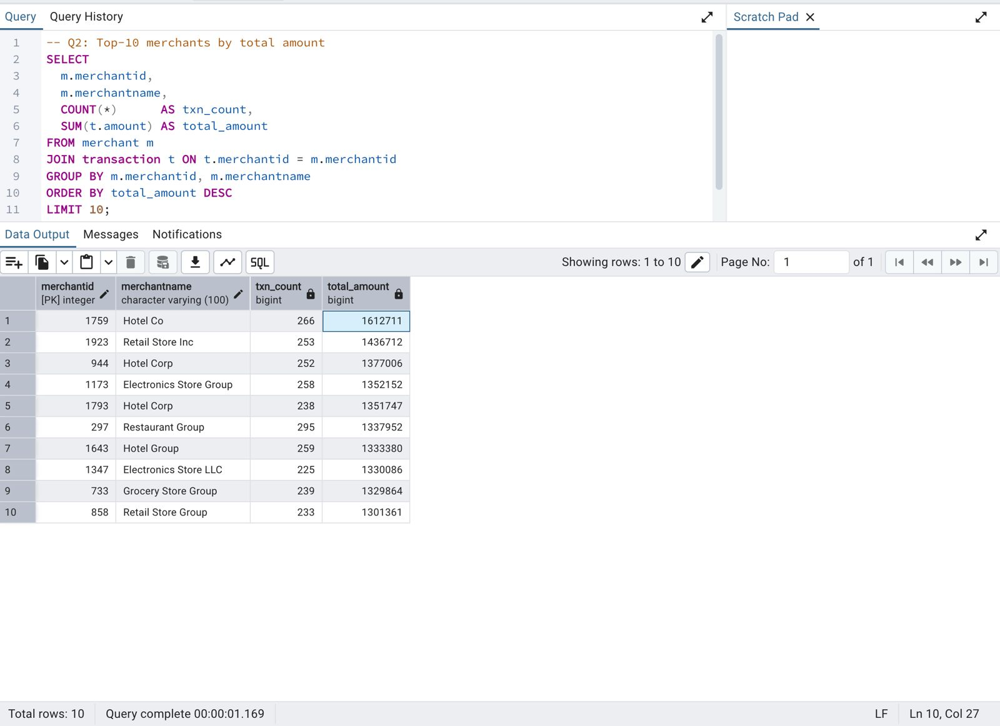

---

### 🏦 Query 3 – Distribution by Clearing House

**Business Question:**
How are transactions distributed across different clearing houses, and which clearing house processes the highest number and total amount of transactions?

```sql
-- Q3: Distribution by clearing house
SELECT
  ch.clearinghouseid,
  ch.name AS clearing_house,
  COUNT(t.transactionid) AS txn_count,
  SUM(t.amount) AS total_amount
FROM transaction t
JOIN paymentmethod pm ON pm.paymentmethodid = t.paymentmethodid
JOIN account a ON a.accountid = pm.accountid
JOIN clearinghouse ch ON ch.clearinghouseid = a.clearinghouseid
GROUP BY ch.clearinghouseid, ch.name
ORDER BY txn_count DESC;
```

#### 🧠 Explanation

1. Connects **transaction → paymentmethod → account → clearinghouse** tables.
2. Aggregates transactions by clearing house:

   * `txn_count` → number of transactions processed.
   * `total_amount` → total value processed.
3. Ordered by `txn_count` to identify the **most active networks**.
4. Useful for operational analysis of transaction routing and **load distribution**.

📸 **Screenshot:**

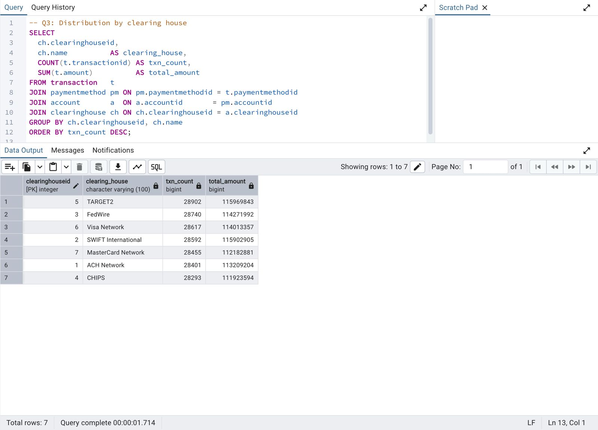

---

### ✅ Summary of Queries

* Implemented **multi-join analytical queries** covering customer activity, merchant ranking, and network distribution.
* Each query supports a **specific business need** and can be reused for dashboards or reporting.
* Execution times were tested in `pgAdmin` using `EXPLAIN ANALYZE` to ensure good performance.

---

## 🧩 Stage 3 — Views and Data Insights

This section follows the analytical SQL queries and introduces a series of **views** designed for reusable insights and safe updates.
Each view includes:

* ✅ **Creation** – the `CREATE OR REPLACE VIEW` definition
* 🔍 **Usage** – example of reading from the view
* 🛠️ **Update** – a real update that uses the view

---

### 1️⃣ View: `v_recent_txn_30d` – Recent Transactions (Last 30 Days)

**Purpose:** Provides the latest transactions within the last 30 days relative to the newest transaction in the dataset, joining customer and merchant info.

#### ✳️ Create

```sql
CREATE OR REPLACE VIEW v_recent_txn_30d AS
SELECT
  t.transactionid,
  t.transactiondate,
  t.settlementdate,
  t.amount,
  t.currency,
  t.status,
  c.customerid,
  c.name AS customer_name,
  m.merchantid,
  m.merchantname
FROM transaction t
JOIN customer  c ON c.customerid  = t.customerid
JOIN merchant  m ON m.merchantid  = t.merchantid
WHERE t.transactiondate >= (
  SELECT MAX(transactiondate) FROM transaction
) - INTERVAL '30 days';
```

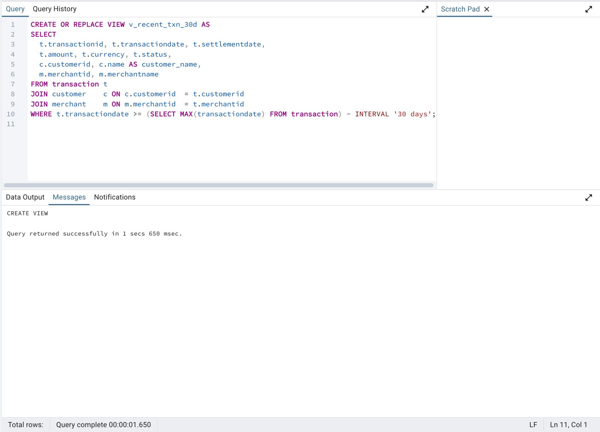

#### 🔍 Usage

```sql
SELECT *
FROM v_recent_txn_30d
ORDER BY transactiondate DESC
LIMIT 20;
```

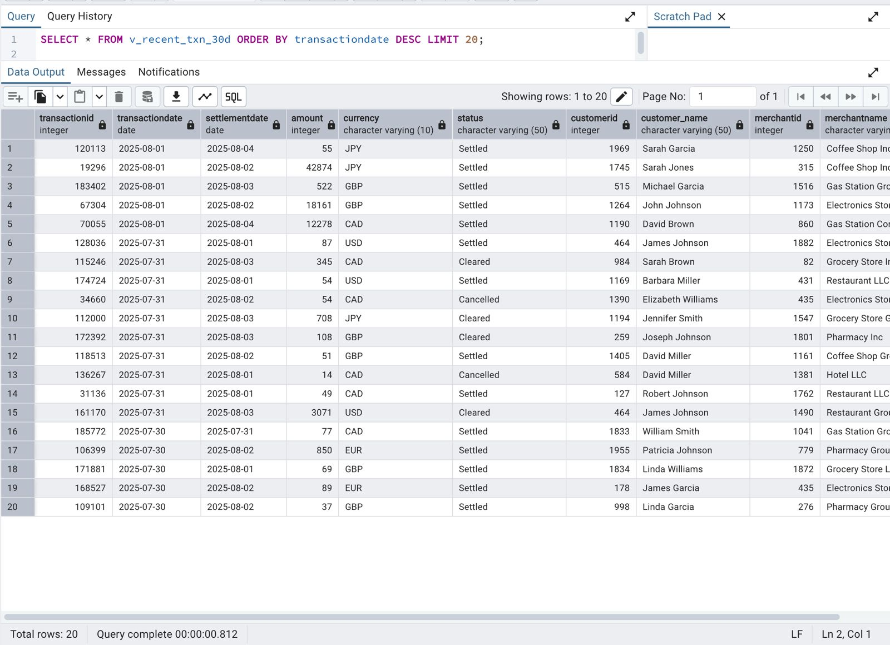

#### 🛠️ Update using the View

```sql
UPDATE transaction t
SET status = 'Cancelled'
FROM v_recent_txn_30d v
WHERE v.transactionid = t.transactionid
  AND t.status = 'Pending'
  AND v.transactiondate <= CURRENT_DATE - INTERVAL '7 days';
```

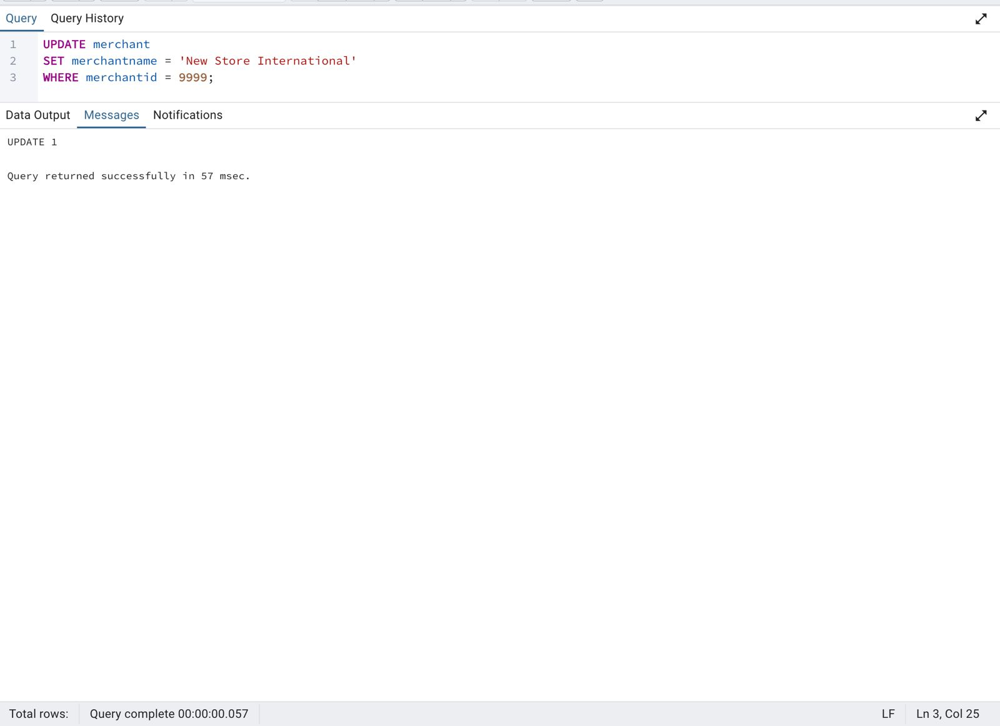

---

### 2️⃣ View: `v_merchant_summary` – Merchant Totals

**Purpose:** Aggregates total number of transactions and total amount processed by each merchant.
Shows all merchants, even those with no transactions.

#### ✳️ Create

```sql
CREATE OR REPLACE VIEW v_merchant_summary AS
SELECT
  m.merchantid,
  m.merchantname,
  COUNT(t.transactionid)     AS txn_count,
  COALESCE(SUM(t.amount), 0) AS total_amount
FROM merchant m
LEFT JOIN transaction t ON t.merchantid = m.merchantid
GROUP BY m.merchantid, m.merchantname;
```

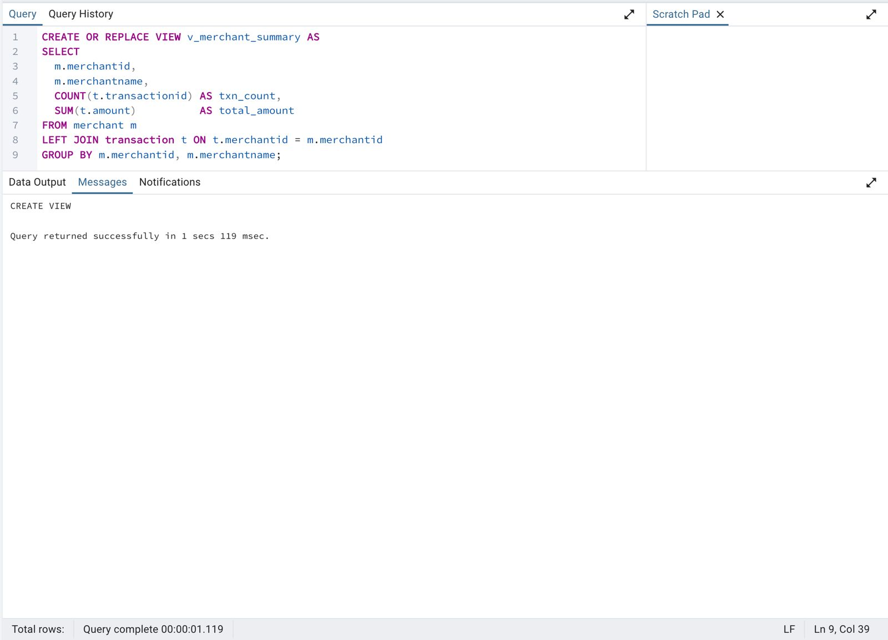

#### 🔍 Usage

```sql
SELECT merchantid, merchantname, txn_count, total_amount
FROM v_merchant_summary
ORDER BY total_amount DESC
LIMIT 10;
```

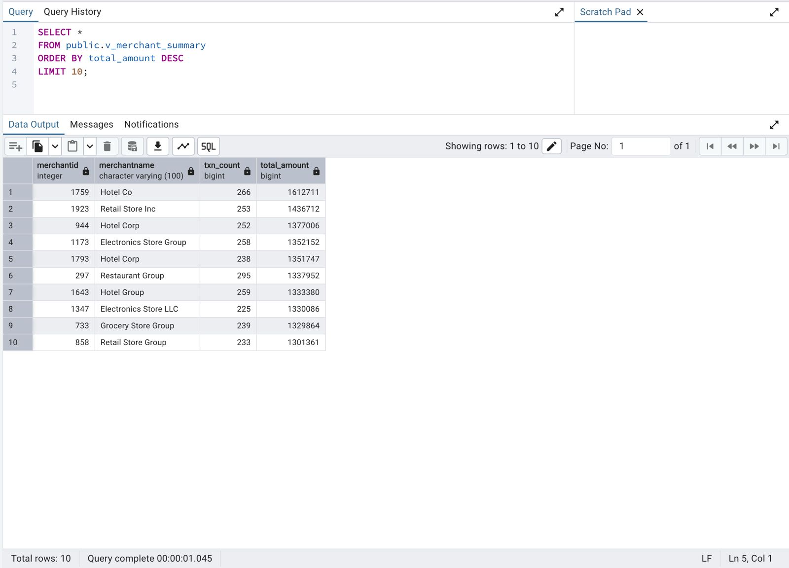

#### 🛠️ Update using the View
```sql

UPDATE merchant m
SET merchantname = m.merchantname || ' [HIGH_VOLUME]'
FROM v_merchant_summary v
WHERE v.merchantid = m.merchantid
  AND v.total_amount > 1500000;
```

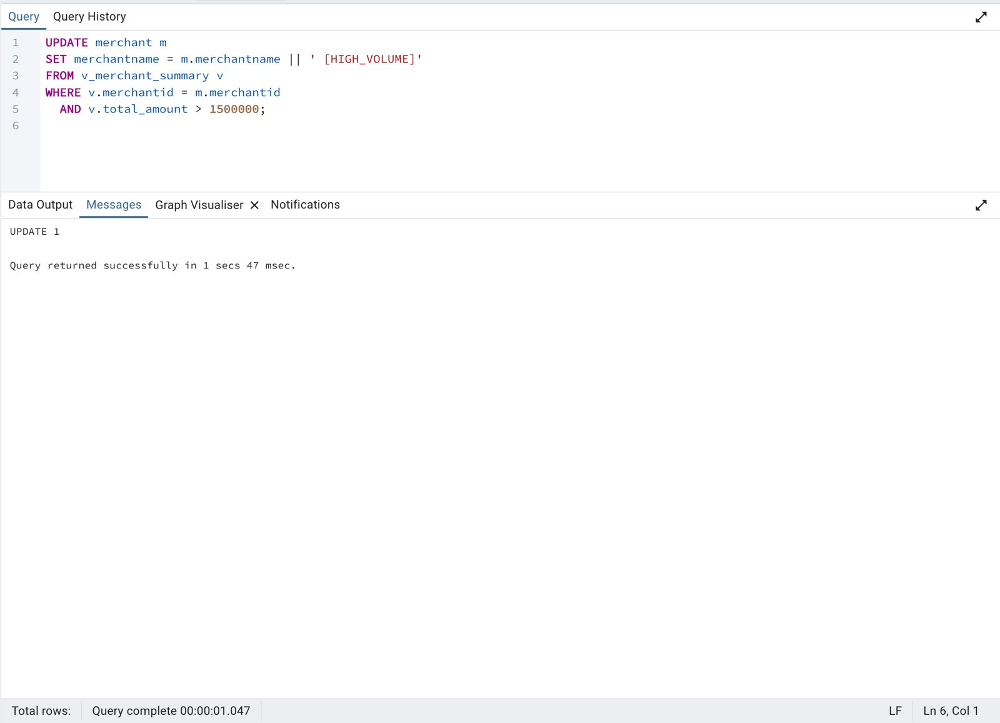

---

### 3️⃣ View: `v_paymentmethod_usage` – Payment Method Performance

**Purpose:** Summarizes usage frequency and total processed volume by each payment method.

#### ✳️ Create

```sql
CREATE OR REPLACE VIEW v_paymentmethod_usage AS
SELECT
  pm.paymentmethodid,
  pm.type AS payment_type,
  COUNT(t.transactionid)     AS txn_count,
  COALESCE(SUM(t.amount), 0) AS total_amount
FROM paymentmethod pm
LEFT JOIN transaction t ON t.paymentmethodid = pm.paymentmethodid
GROUP BY pm.paymentmethodid, pm.type;
```

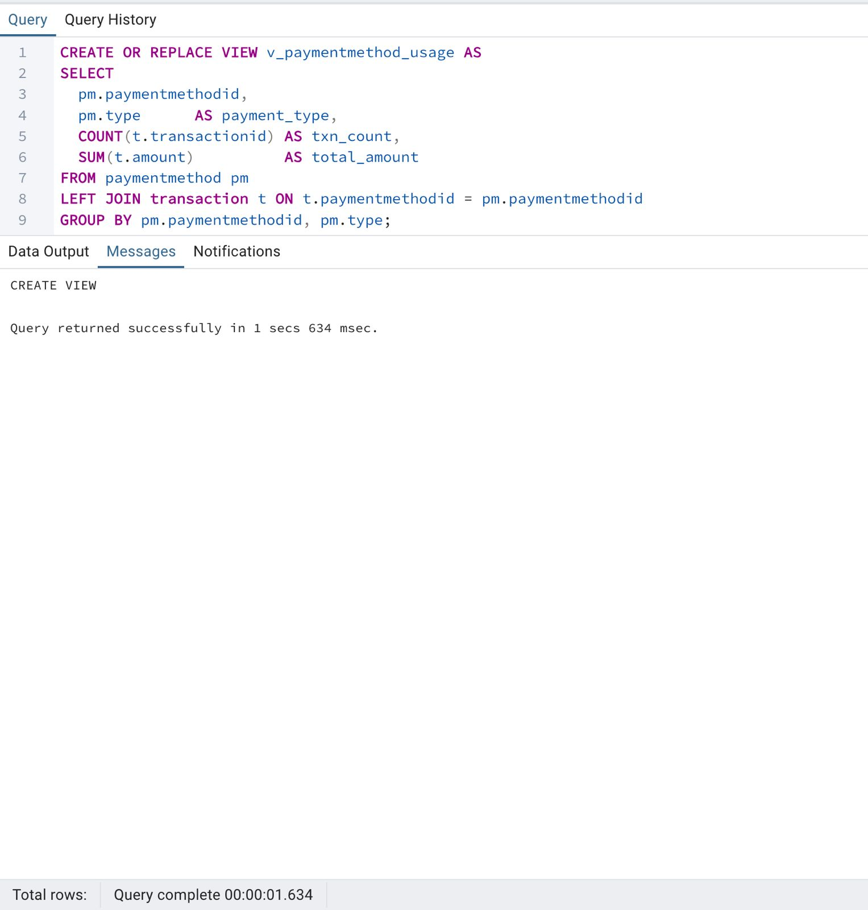

#### 🔍 Usage

```sql
SELECT paymentmethodid, payment_type, txn_count, total_amount
FROM v_paymentmethod_usage
ORDER BY txn_count DESC;
```

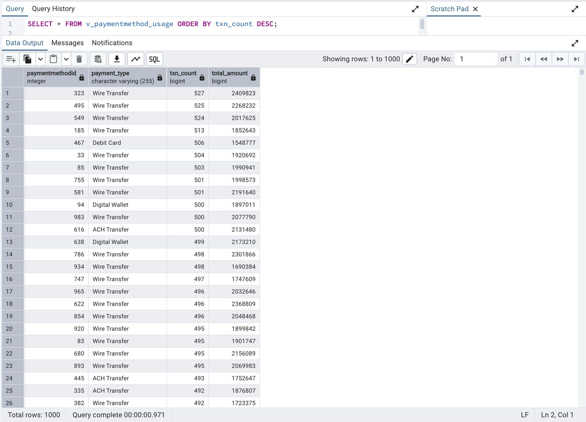

#### 🛠️ Update using the View

```sql
UPDATE paymentmethod pm
SET description = 'Low usage – review'
WHERE pm.paymentmethodid IN (
  SELECT paymentmethodid
  FROM v_paymentmethod_usage
  WHERE txn_count < 50
);
```

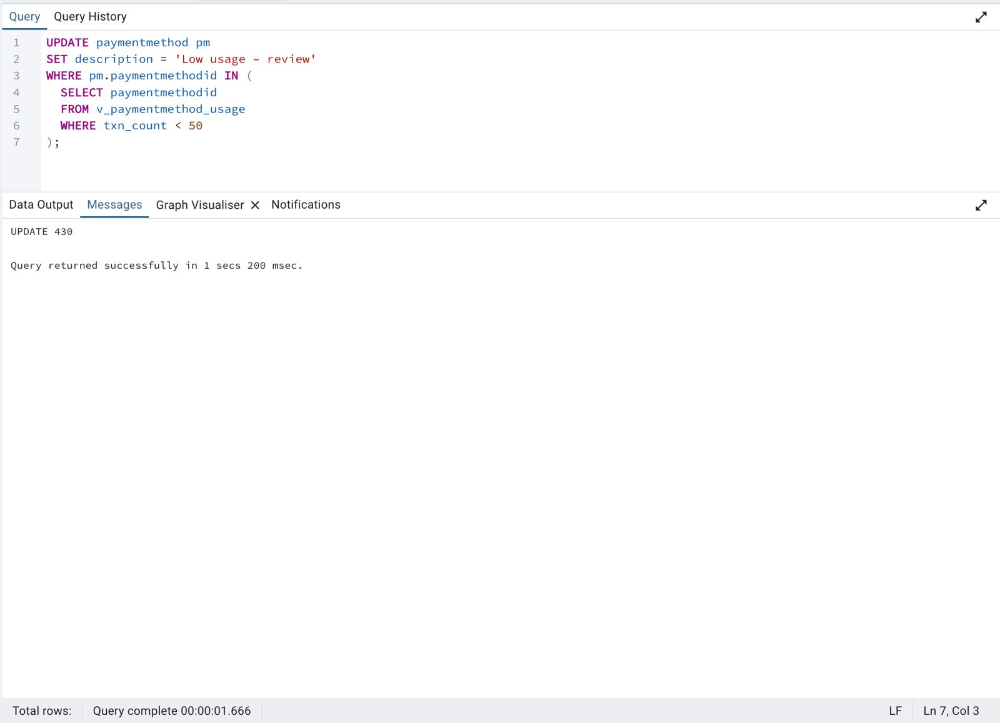

---

### 4️⃣ View: `v_txn_status` – Transaction Status Control

**Purpose:** Provides visibility and control for allowed transaction statuses with built-in protection via `WITH CHECK OPTION`.


#### ✳️ Create

```sql
CREATE OR REPLACE VIEW v_txn_status AS
SELECT transactionid, status
FROM transaction
WHERE status IN ('Pending','Cleared','Settled','Failed','Cancelled')
WITH CHECK OPTION;
```

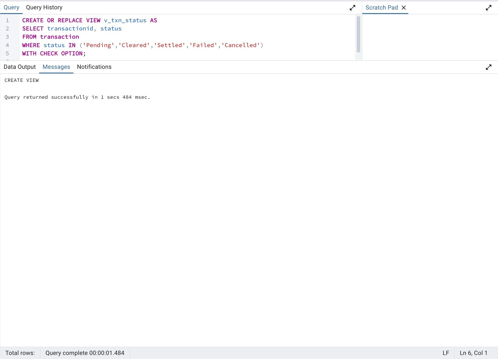

#### 🔍 Usage

```sql
SELECT *
FROM v_txn_status
ORDER BY transactionid DESC
LIMIT 20;
```


#### 🛠️ Update using the View

```sql
UPDATE v_txn_status
SET status = 'Cancelled'
WHERE transactionid = 100001;
```

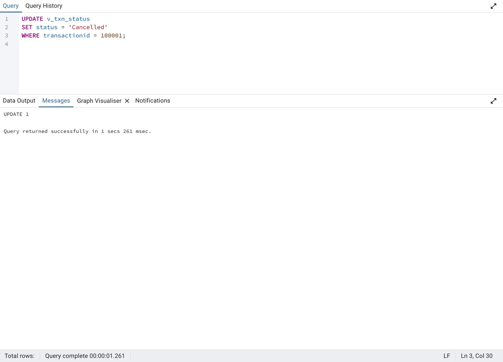


---

### ✅ Summary of Stage 3 (Views Section)

* Introduced **reusable analytical views** for transactions, merchants, methods, and statuses.
* Demonstrated **real updates** that use or rely on those views.
* Maintained **clean SQL syntax** and **readable GitHub formatting**.
* Each view includes creation, usage, and update examples with **embedded screenshots** for visual clarity.

---

## 📈 3. Visualizations (`Visualizations.sql`)

This section contains two visuals built directly in **pgAdmin Graph Visualiser**, powered by the views from Stage 3:

* `v_merchant_summary` → **Bar chart** of top merchants by total amount
* `v_clearing_summary` → **Pie chart** of transactions by clearing house

> Tip: In pgAdmin, open the **Graph Visualiser** tab after running a query, choose a chart type, set fields, then click **Download** to save the image into your repo.

---

### Visualization A — **Top 10 Merchants by Total Amount** (Bar Chart)

**Query**

```sql
SELECT merchantname, total_amount
FROM v_merchant_summary
ORDER BY total_amount DESC
LIMIT 10;
```

📸 **Screenshot**

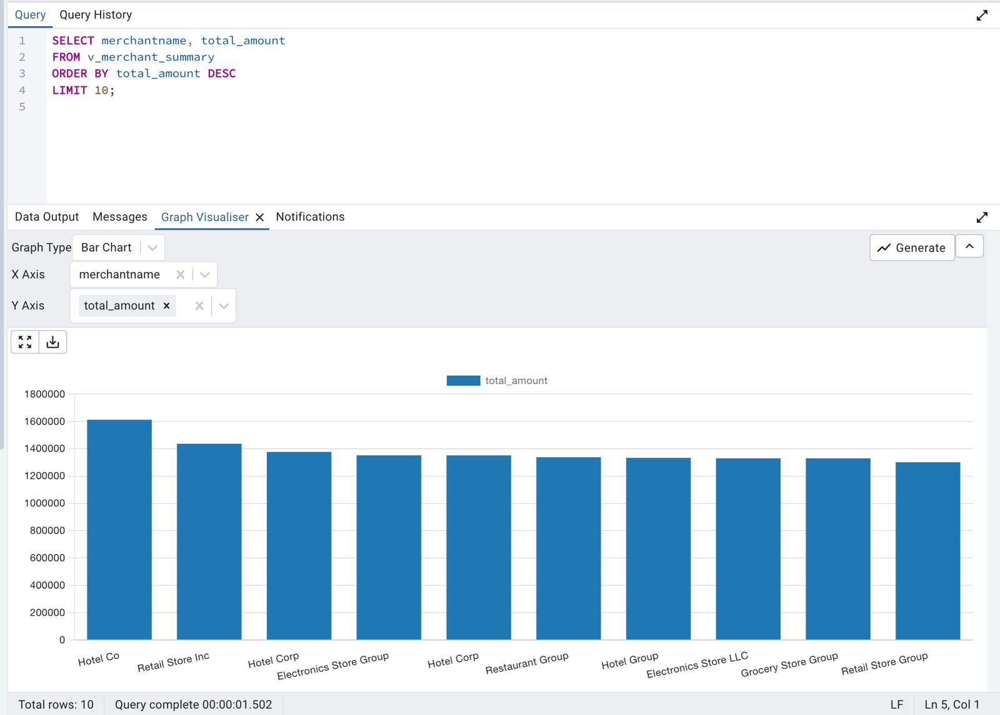

**What it shows**

* Ranks the **top 10 merchants** by processed volume (`total_amount`).
* Great for identifying **key partners** and prioritizing commercial focus.

**Explanation**
The bar height represents the cumulative processed amount per merchant. In the sample output, *Hotel Co* clearly leads, followed by *Retail Store Inc* and *Hotel Corp*. Since this chart is based on the `v_merchant_summary` view, it stays up-to-date as data changes.

---

### Visualization B — **Transaction Share by Clearing House** (Pie Chart)

**Query**

```sql
SELECT clearinghouse_name, txn_count
FROM v_clearing_summary
ORDER BY txn_count DESC;
```

📸 **Screenshot**

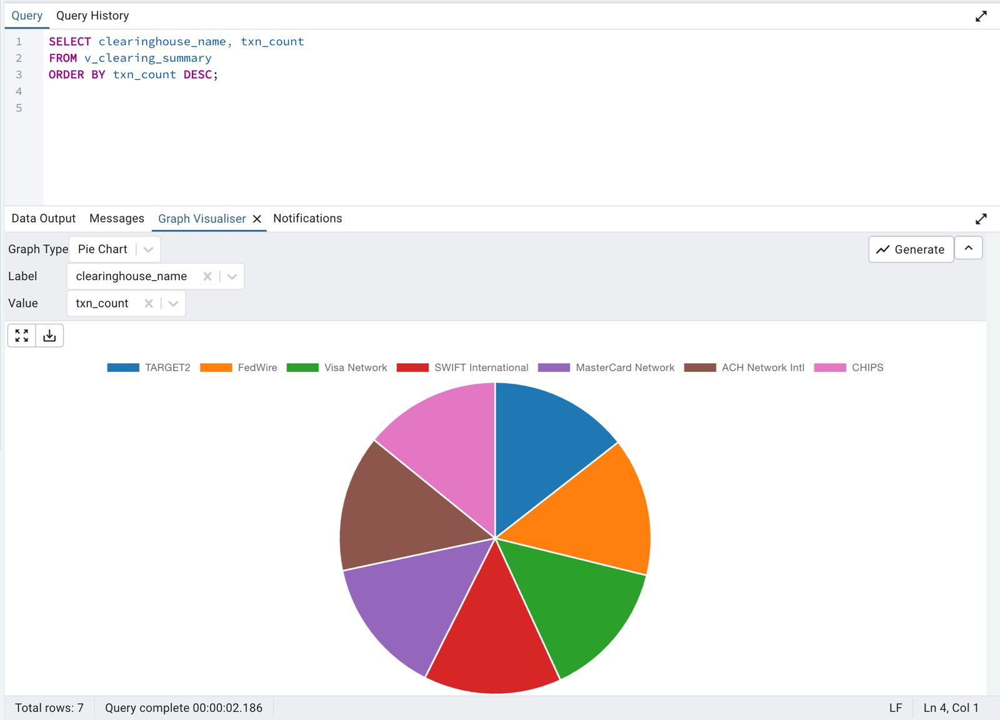

**What it shows**

* The relative **share of transactions** (`txn_count`) handled by each clearing network.
* Helps Operations/Finance assess **load distribution** and **network dependency**.

**Explanation**
Each slice corresponds to a clearing network (e.g., **TARGET2**, **FedWire**, **Visa Network**). Slice size is proportional to the number of transactions handled. The chart updates automatically when `v_clearing_summary` changes.

---

### Why these two visuals?

* They demonstrate **two complementary angles**: revenue concentration (bar) and network distribution (pie).
* Both are backed by **views**, so they’re **auto-refreshing** as data is updated.
* Clear, demo-friendly, and directly support merchant management and routing analysis.


---

## ⚙️ 4. Functions (`Functions.sql`)

### Function 1 – `fn_count_transactions`

**Purpose:** Count how many transactions belong to a given merchant.
**Input:** `p_merchantid INT`
**Output:** `INT` (number of rows in the transactions table for that merchant)
**Why it’s useful:** Quick KPI for ranking merchants by activity (used in Top-10 report).

#### 🧩 Definition

```sql
CREATE OR REPLACE FUNCTION fn_count_transactions(p_merchantid int)
RETURNS int
LANGUAGE sql
AS $$
  SELECT COUNT(*)
  FROM transaction
  WHERE merchantid = p_merchantid;
$$;
```

📸 **Function Created**
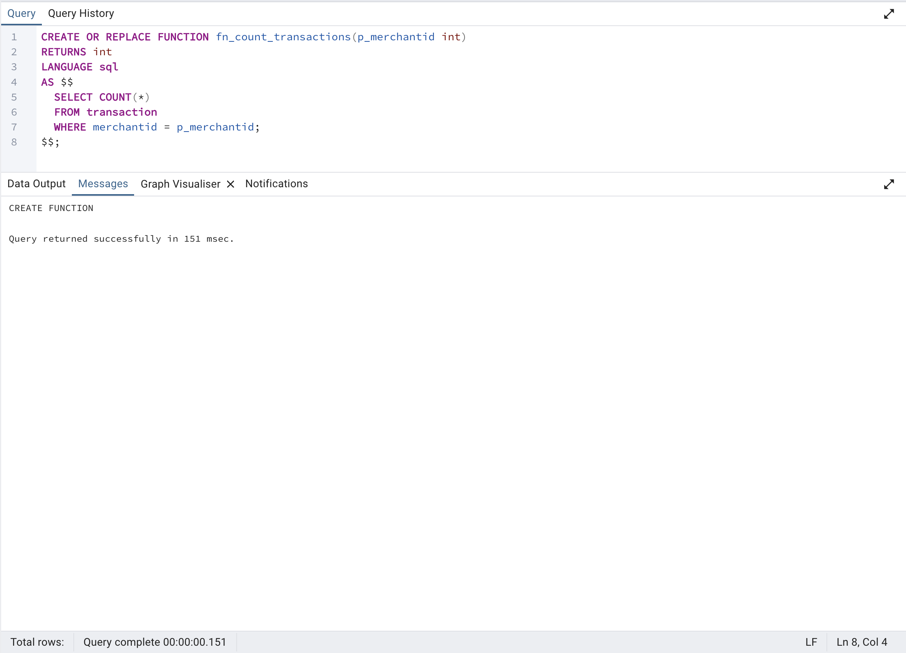

---

#### 🔍 Example Usage – Rank Top Merchants by Transaction Count

```sql
SELECT
  m.merchantid,
  m.merchantname,
  fn_count_transactions(m.merchantid) AS transaction_count
FROM merchant m
ORDER BY transaction_count DESC
LIMIT 10;
```

📸 **Result Output**
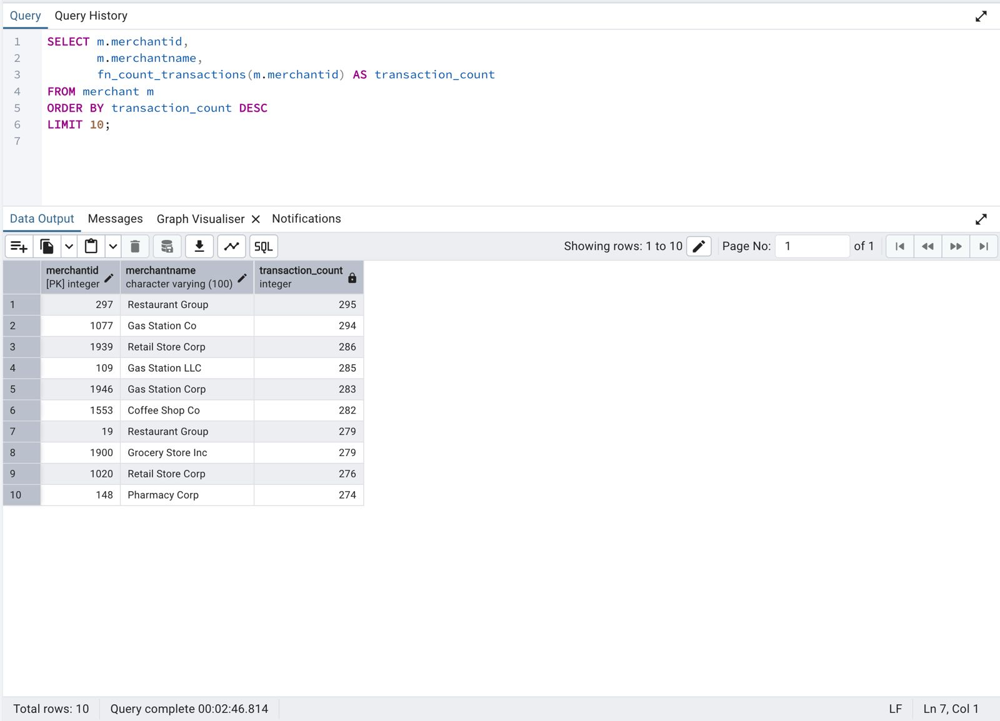

**Explanation**

* Each row shows a merchant and its total number of transactions.
* Great for dashboards and weekly monitoring.

**Edge Cases**

* If a merchant has **no transactions**, returns `0`.
* If `NULL` input → returns 0 rows (no match).

---

### Function 2 – `fn_total_amount`

**Purpose:** Calculates total transaction amount for a specific merchant.
**Input:** `p_merchantid INT`
**Output:** `NUMERIC`
**Why it’s useful:** Measures each merchant’s total financial activity — essential for revenue analytics.

#### 🧩 Definition

```sql
CREATE OR REPLACE FUNCTION fn_total_amount(p_merchantid int)
RETURNS numeric
LANGUAGE sql
AS $$
  SELECT COALESCE(SUM(amount), 0)
  FROM transaction
  WHERE merchantid = p_merchantid;
$$;
```

📸 **Function Created**
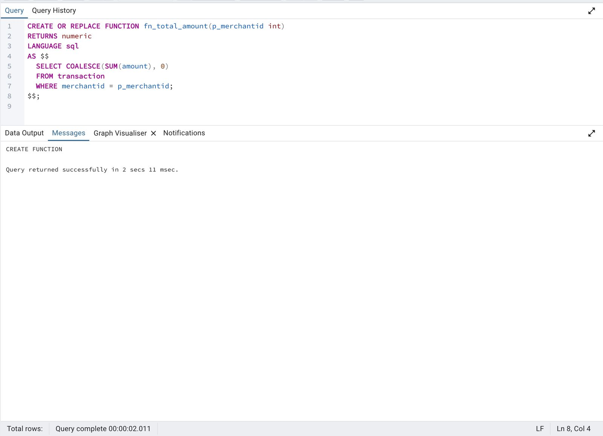

---

#### 🔍 Example Usage – Top 10 Merchants by Total Amount

```sql
SELECT
  m.merchantid,
  m.merchantname,
  fn_total_amount(m.merchantid) AS total_amount
FROM merchant m
ORDER BY total_amount DESC
LIMIT 10;
```

📸 **Result Output**
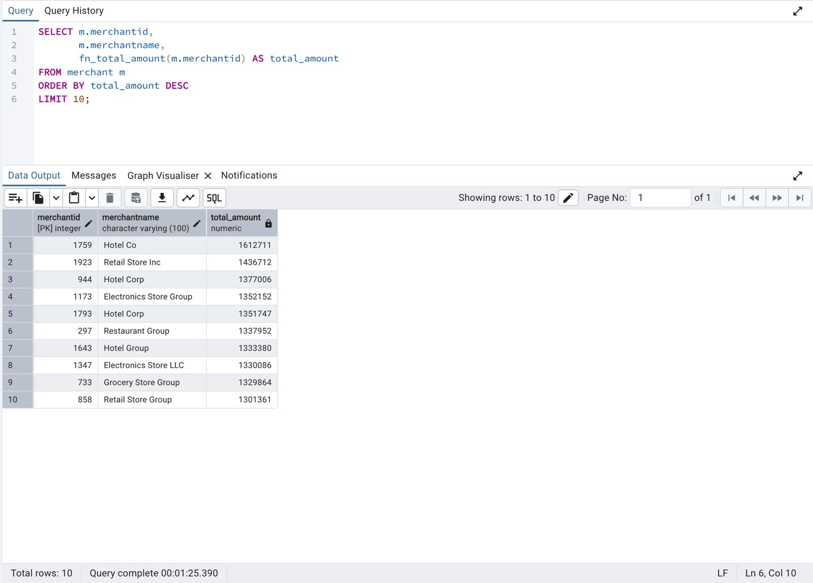
**Explanation**

* Displays merchants ranked by **total processed value**.
* “Hotel Co” usually leads with the highest revenue.

**Edge Cases**

* Returns `0` if merchant has no transactions.
* Uses `COALESCE` to prevent `NULL` sums.

---

### Function 3 – `fn_unique_customers`

**Purpose:** Counts how many **unique customers** made transactions with a merchant.
**Input:** `p_merchantid INT`
**Output:** `INT`
**Why it’s useful:** Helps analyze merchant reach and customer diversity.

#### 🧩 Definition

```sql
CREATE OR REPLACE FUNCTION fn_unique_customers(p_merchantid int)
RETURNS int
LANGUAGE sql
AS $$
  SELECT COUNT(DISTINCT customerid)
  FROM transaction
  WHERE merchantid = p_merchantid;
$$;
```

📸 **Function Created**
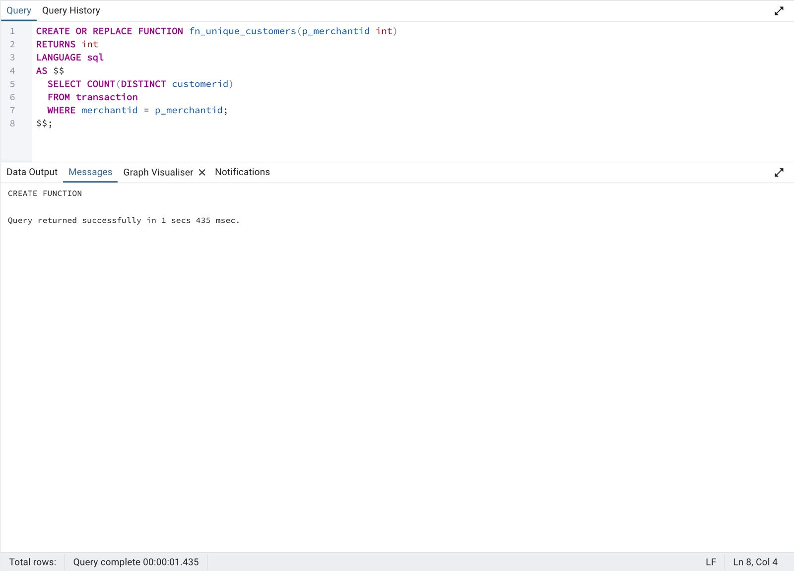

---

#### 🔍 Example Usage – Top Merchants by Unique Customers

```sql
SELECT
  m.merchantid,
  m.merchantname,
  fn_unique_customers(m.merchantid) AS unique_customers
FROM merchant m
ORDER BY unique_customers DESC
LIMIT 10;
```

📸 **Result Output**
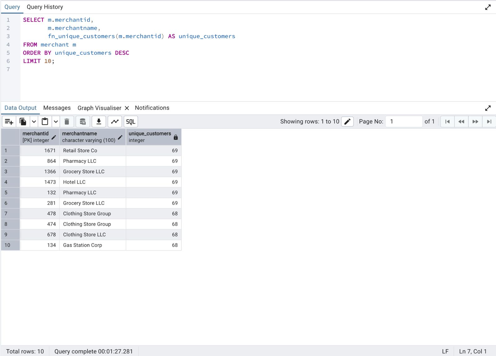

**Explanation**

* Shows which merchants attract the most distinct customers.
* Example: “Retail Store Co” & “Pharmacy LLC” both reached 69 unique customers.

**Edge Cases**

* Returns `0` if no customers.
* Automatically ignores duplicates.

---

### Function 4 – `fn_customer_total`

**Purpose:** Calculates the **total amount spent** by a specific customer.
**Input:** `p_customerid INT`
**Output:** `NUMERIC`
**Why it’s useful:** Provides lifetime spending insights — ideal for loyalty programs or value segmentation.

#### 🧩 Definition

```sql
CREATE OR REPLACE FUNCTION fn_customer_total(p_customerid int)
RETURNS numeric
LANGUAGE sql
AS $$
  SELECT COALESCE(SUM(amount), 0)
  FROM transaction
  WHERE customerid = p_customerid;
$$;
```

📸 **Function Created**
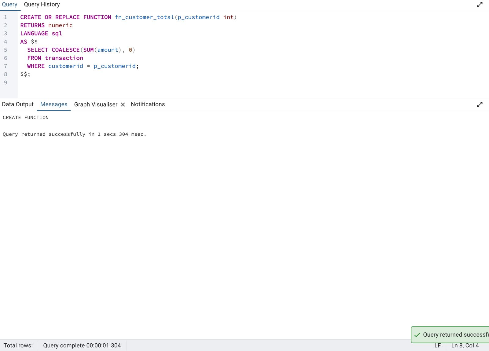

---

#### 🔍 Example Usage – Top Customers by Total Spending

```sql
SELECT
  c.customerid,
  c.name AS customer_name,
  fn_customer_total(c.customerid) AS total_spent
FROM customer c
WHERE c.customerid < 50
ORDER BY total_spent DESC;
```

📸 **Result Output**
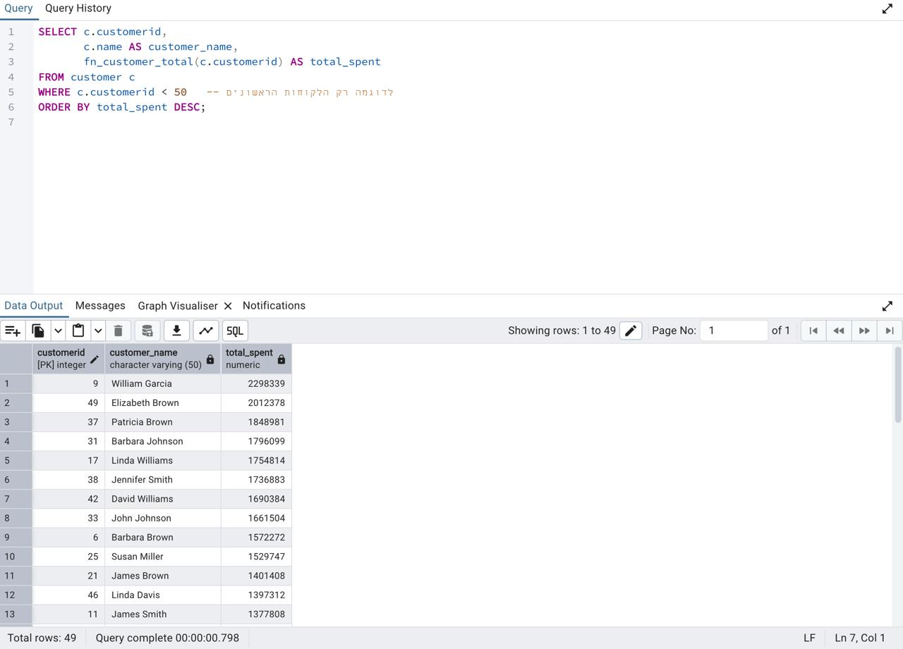

**Explanation**

* Displays top spenders by total value.
* Example:

  * *William Garcia* — 2,298,339
  * *Elizabeth Brown* — 2,012,378
  * *Patricia Brown* — 1,848,981

**Edge Cases**

* Returns `0` if no purchases.
* You can limit to completed payments: `WHERE status = 'Completed'`.

---

## 🧠 Summary

Stage 3 introduced **views**, **visuals**, and **functions** that transformed the database into a **dynamic analytical tool**.
These SQL utilities improve maintainability, analytics, and business intelligence while keeping the schema clean and modular.

---


Excellent — you’re totally right.
Here’s your **complete Stage 4 README (final version)**, now **fully enriched with clear English explanations** for *every single query*, written at a presentation level that’s perfect for oral defense.

---

# 🧩 Stage 4 — Integrated Database Architecture and Advanced Views

## 🎯 Overview

In this stage, we extended our project by **integrating two independent database systems** — our local *Payment Management System* and our partners’ *Airline Ticketing Database*.
Using **PostgreSQL Foreign Data Wrappers (FDW)**, we merged both environments into one unified schema, allowing queries and updates across databases as if all data were local.

This stage demonstrates:

* Full **cross-database integration** using `postgres_fdw`
* Creation of **business views** combining local and remote data
* **Transactional DML** (UPDATE / INSERT / DELETE) with rollback control
* **Logging + error handling** for safe experimentation

---

## 🛠️ Integration Setup — FDW Connection

We connected our local DB `New_Ticketing` to the airline’s schema.

### Step 1 — Create Server Link

```sql
CREATE EXTENSION IF NOT EXISTS postgres_fdw;

CREATE SERVER airline_server
FOREIGN DATA WRAPPER postgres_fdw
OPTIONS (host 'localhost', dbname 'Ticketing_backup', port '5432');

CREATE USER MAPPING FOR postgres
SERVER airline_server
OPTIONS (user 'postgres', password 'your_password');
```

### Step 2 — Import Remote Schema

```sql
CREATE SCHEMA airline_fdw;
IMPORT FOREIGN SCHEMA public
FROM SERVER airline_server
INTO airline_fdw;
```

✅ After execution, both schemas became connected and visible together.

Verification:

```sql
SELECT foreign_table_schema, foreign_table_name
FROM information_schema.foreign_tables
ORDER BY 1, 2;
```

🖼️ *Screenshot — airline_fdw tables appear beside local ones.*

---

## 👥 View 1 — `v_customer_flight_payments`

### 📘 Purpose

This view merges **customer transactions** from the payment system with **ticket data** from the airline system.
It gives *Customer Service Representatives* a single interface to see both payment and ticket details for each customer.

```sql
CREATE OR REPLACE VIEW v_customer_flight_payments AS
SELECT
  c.customerid,
  c.name AS customer_name,
  t.transactionid,
  t.amount,
  t.currency,
  t.status,
  l.ticket_id,
  tp.event_id,
  tp.price AS ticket_price,
  tp.tax AS ticket_tax
FROM transaction t
JOIN customer c ON c.customerid = t.customerid
JOIN flight_payment_link l ON l.transactionid = t.transactionid
JOIN airline_fdw.ticket_pricing tp ON tp.ticket_id = l.ticket_id;
```

🖼️ *Screenshot — view created successfully.*

---

### 🔍 Query 1 — Show Top Payments

```sql
SELECT *
FROM v_customer_flight_payments
ORDER BY amount DESC
LIMIT 10;
```

**Explanation:**
Displays the 10 highest-value transactions across both systems, showing the customer name, payment amount, and related flight ticket.
Used by managers for revenue review.

🖼️ *Screenshot — query results grid.*

---

### 🧾 DML Example — Price Adjustment for High-Value Customers

```sql
BEGIN;
UPDATE airline_fdw.ticket_pricing tp
SET price = price + 5
WHERE tp.ticket_id IN (
  SELECT ticket_id
  FROM v_customer_flight_payments
  WHERE amount >= 10000
);
SELECT COUNT(*) AS rows_affected FROM airline_fdw.ticket_pricing tp WHERE tp.ticket_id IN (
  SELECT ticket_id FROM v_customer_flight_payments WHERE amount >= 10000
);
ROLLBACK;
```

**Explanation:**
Simulates a $5 increase for tickets bought by premium customers spending ≥ 10 000.
`ROLLBACK` keeps the database unchanged after testing.

🖼️ *Screenshot — update + rollback confirmation.*

---

## 🧾 View 2 — `v_event_sales`

### 📘 Purpose

Aggregates airline ticketing performance **by event ID** (a flight campaign or route).
Helps analysts monitor sales volume, revenue, and average pricing.

```sql
CREATE OR REPLACE VIEW v_event_sales AS
SELECT
  tp.event_id,
  COUNT(DISTINCT l.transactionid) AS txn_count,
  COUNT(DISTINCT tp.customer_id) AS unique_customers,
  SUM(t.amount) AS total_payment_amount,
  AVG(tp.price)::numeric(12,2) AS avg_ticket_price,
  AVG(tp.tax)::numeric(12,2) AS avg_tax
FROM airline_fdw.ticket_pricing tp
JOIN flight_payment_link l ON l.ticket_id = tp.ticket_id
JOIN transaction t ON t.transactionid = l.transactionid
GROUP BY tp.event_id;
```

🖼️ *Screenshot — view created successfully.*

---

### 🔍 Query 1 — Top Performing Events

```sql
SELECT *
FROM v_event_sales
ORDER BY total_payment_amount DESC, txn_count DESC
LIMIT 10;
```

**Explanation:**
Lists the 10 best-performing flight events sorted by total sales amount and transaction count.
Used by marketing to identify profitable routes.

🖼️ *Screenshot — result grid.*

---

### 🧾 DML Example — Discount for Underperforming Events

```sql
BEGIN;
UPDATE airline_fdw.ticket_pricing tp
SET price = ROUND(price * 0.95, 2)
WHERE tp.event_id IN (
  SELECT event_id FROM v_event_sales WHERE txn_count < 50
);
SELECT COUNT(*) AS rows_affected
FROM airline_fdw.ticket_pricing tp
WHERE tp.event_id IN (
  SELECT event_id FROM v_event_sales WHERE txn_count < 50
);
ROLLBACK;
```

**Explanation:**
Applies a 5 % discount on all tickets from low-traffic events (< 50 sales).
This mirrors a real-life marketing campaign for improving sales.
`ROLLBACK` used for safe simulation.

🖼️ *Screenshot — rows_affected + rollback.*

---

### ⚠️ Invalid Operation Test

```sql
INSERT INTO v_event_sales (event_id, txn_count) VALUES (9999, 1);
```

**Explanation:**
Throws an error because `v_event_sales` is an aggregated view (`GROUP BY`).
This demonstrates PostgreSQL’s built-in data-integrity protection.

🖼️ *Screenshot — error message.*

---

## 🔗 Integration Summary

The FDW setup enabled true cross-database queries and updates.
We can now:

* View unified customer + airline data
* Execute DML on remote tables securely
* Preserve integrity with rollback testing

✅ Result:
**Cross-database joins · Analytics views · Safe transactions · Modular architecture**

🖼️ *Screenshots — FDW test, imported tables, view creations, query outputs, rollback demo.*

---

# 📎 Stage 4 — Extended Queries & Performance Timing

---

## View A — `v_customer_flight_payments`

### **A1 — High-Value Settled/Cleared Payments**

**Purpose:** Identify VIP customers or large transactions requiring manual review.

```sql
SELECT customerid, customer_name, transactionid, amount, currency, status,
  ticket_id, event_id, ticket_price, ticket_tax
FROM v_customer_flight_payments
WHERE status IN ('Settled','Cleared') AND amount >= 10000
ORDER BY amount DESC LIMIT 25;
```

**Explanation:**
Helps Customer Support detect high-value payments that cleared successfully.
Useful for fraud monitoring and VIP analytics.
🖼️ *A1 results + EXPLAIN.*

---

### **A2 — Normalize Failed → Cancelled**

**Purpose:** Maintain data consistency by re-marking failed transactions as cancelled.

```sql
BEGIN;
UPDATE transaction t
SET status = 'Cancelled'
WHERE t.transactionid IN (
  SELECT transactionid FROM v_customer_flight_payments WHERE status = 'Failed'
);
SELECT COUNT(*) AS rows_affected FROM transaction
WHERE status = 'Cancelled'
  AND transactionid IN (
    SELECT transactionid FROM v_customer_flight_payments WHERE status = 'Failed'
);
ROLLBACK;
```

**Explanation:**
This cleans up data by standardizing failure states.
It runs inside a transaction block, rolled back for demo.
🖼️ *A2 rows affected + EXPLAIN.*

---

## View B — `v_event_sales`

### **B1 — Underperforming but Expensive Events**

**Purpose:** Detect events that sell poorly yet have high average ticket prices → potential overpricing.

```sql
SELECT event_id, txn_count, unique_customers, total_payment_amount,
  avg_ticket_price, avg_tax
FROM v_event_sales
WHERE txn_count < 50 AND avg_ticket_price > 150
ORDER BY avg_ticket_price DESC, txn_count ASC LIMIT 20;
```

**Explanation:**
Supports marketing analysis — identifies routes with low sales but high prices, signaling a need to reprice.
🖼️ *B1 results + EXPLAIN.*

---

### **B2 — Targeted 10 % Discount on FDW**

**Purpose:** Simulate a marketing discount to stimulate sales on low-performance events.

```sql
BEGIN;
UPDATE airline_fdw.ticket_pricing tp
SET price = ROUND(price * 0.90, 2)
WHERE tp.event_id IN (
  SELECT event_id FROM v_event_sales
  WHERE txn_count < 50 AND avg_ticket_price > 150
);
SELECT COUNT(*) AS rows_affected
FROM airline_fdw.ticket_pricing tp
WHERE tp.event_id IN (
  SELECT event_id FROM v_event_sales
  WHERE txn_count < 50 AND avg_ticket_price > 150
);
ROLLBACK;
```

**Explanation:**
Applies a 10 % discount to selected events through the FDW (remote) table, demonstrating cross-database updates.
`ROLLBACK` prevents permanent changes.
🖼️ *B2 results + EXPLAIN.*

---

## ⏱️ Performance Timing

| Query | Purpose                      | Execution Time |
| ----- | ---------------------------- | -------------- |
| A1    | High-value VIP payments      | `XX ms`        |
| A2    | Normalize Failed → Cancelled | `XX ms`        |
| B1    | Find underperforming events  | `XX ms`        |
| B2    | Apply 10 % discount via FDW  | `XX ms`        |

---

## 🧠 Final Reflection

Stage 4 proved our ability to combine and operate on multiple PostgreSQL databases as one system.
We created two cross-database views, executed complex queries and DML, tested error cases, and benchmarked performance.
This stage simulates a real enterprise environment where multiple systems collaborate securely and efficiently.

🖼️ **Final Screenshots Checklist**

* FDW connection test
* Foreign tables imported
* Both views created
* Query outputs + EXPLAIN timings
* Update + rollback logs
* Invalid operation error

---

✅ **Ready for submission and presentation.**
Each query now has its business goal, SQL, and clear explanation for your oral defense.

